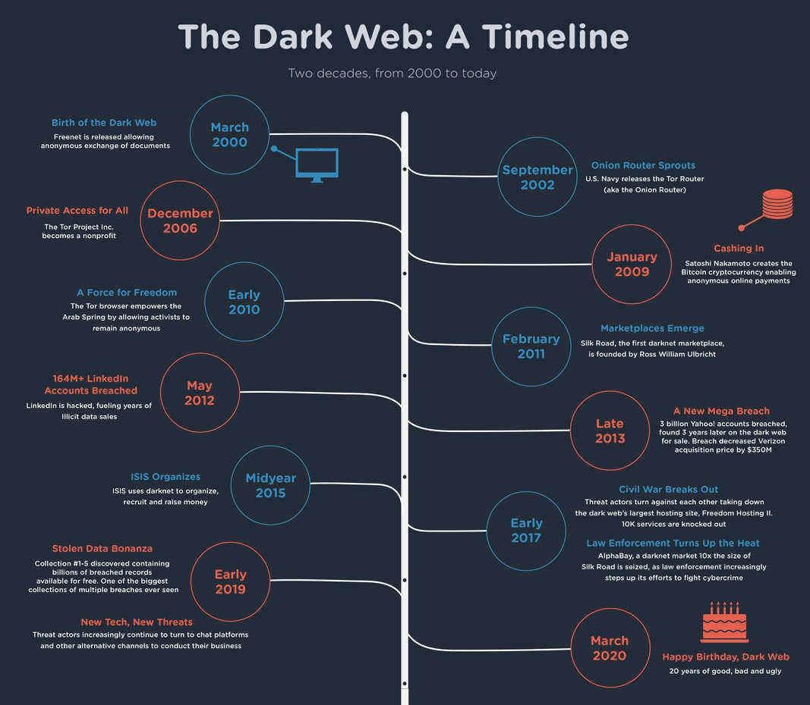
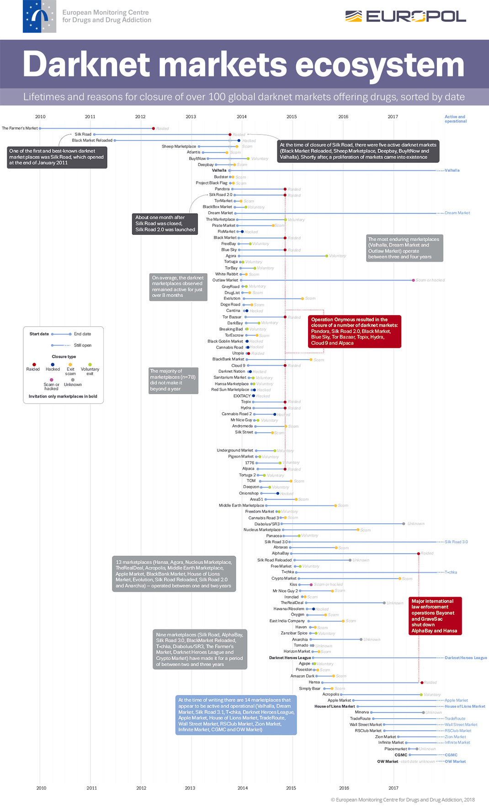

<!DOCTYPE html>
<html lang="en">
<head>
  <meta charset="UTF-8">
  <meta name="viewport" content="width=device-width, initial-scale=1.0">
<!--
<title>ONION LINKS</title>

-->
</head>
<body>

  

  <h1>👽🤡🧙👻💀 ONION LINKS 💀👻🧙🤡👽</h1>
  
  <blockquote><h3>"If the government or the parties won't address our needs, we will. It's about direct action, even civil disobedience." (Edward Snowden)</h3></blockquote>
  

  

  

  <!-- ############################################################ -->

  

  
  

  <!-- ############################################################ -->
  
  <h4>Secure Systems</h4>
  
  
Read <a href="https://tb-manual.torproject.org" target="_blank" rel="noopener noreferrer">Tor Browser User Manual</a> for information on how to use Tor. Consider using secure systems, in order of complexity and resource intensity: <a href="https://tails.net/">Tails</a>, <a href="https://www.whonix.org/">Whonix</a> and <a href="https://www.qubes-os.org/">Qubes</a>.
  
<ul>
  <li>Tails easy install script from Debian based systems: <a href="https://github.com/RENANZG/My-Onion-Links/blob/main/tails_install.sh">tails_install.sh</a>.</li>
  <li>Tails easy install script from Windows: <a href="https://github.com/RENANZG/My-Onion-Links/blob/main/tails_install.sh">tails_install.ps1</a>.
  </li>
</ul>

  
If you wish, send improvements to: <a href="https://github.com/RENANZG/My-Onion-Links/discussions/2">My-Onion-Links Discussions</a>

  <h4>Bookmarks</h4>

  
Ready-to-import bookmarks: <a href="https://github.com/RENANZG/My-Onion-Links/blob/main/Import_Bookmarks_from_HTML.html">Import_Bookmarks_from_HTML.html</a>

  

  <!-- ############################################################ -->

  

  
<b>The Basics of the Dark Web</b>

  
  
  
   

  
  
  
   

  

  
  
  
   

  
   

  
   

  
  
   

  

  
   

  
  
   
  
  
   

  

  <!--############################## -->

  

  
<b>Tor Settings for Dark Web</b>

   

  <h4>Tor Browser Security Settings</h4>

  <h2>Privacy Preferences (<code>about:preferences#privacy</code>)</h2>

  
To access privacy preferences, go to (CTRL + L):

  <pre><code>about:preferences#privacy</code></pre>

  
Adjust the following settings:

  <ul>
    <li><strong>Prioritize .onion sites when known</strong> - Always prioritize
      .onion websites for enhanced security within the Tor network.</li>
    <li><strong>Security Level</strong> - Choose the <em>Safest</em> level
      to disable potentially insecure features like JavaScript by default.</li>
  </ul>

  <h2>Tor Network Settings (<code>about:preferences#tor</code>)</h2>

  
To configure Tor network settings, navigate to (CTRL + L):

  <pre><code>about:preferences#tor</code></pre>

  
Configure the following options:

  <ul>
    <li><strong>Always connect automatically</strong> - Ensures Tor connects
      automatically when you start Tor Browser, maintaining your anonymity.</li>
    <li><strong>Use a bridge</strong> - Select a built-in bridge to obfuscate
      your Tor traffic and prevent ISP detection.</li>
  </ul>

  <h5>How Tor Bridges Work</h5>

  
Tor bridges are specialized relays used to bypass censorship and enhance
    your privacy when connecting to the Tor network. They are particularly
    useful in situations where access to the Tor network is restricted
    or monitored by ISPs or governments.

  
When you connect to the Tor network, your ISP can see that you are using
    Tor based on the distinctive network traffic patterns it generates.
    This can lead to censorship or monitoring of Tor usage.

  
Tor bridges help in circumventing this detection by acting as intermediary
    relays that are not publicly listed in the main Tor directory. They
    employ various techniques, such as <strong>obfuscation</strong> (e.g.,
    <a href="https://tb-manual.torproject.org/bridges/">obfs4 protocol</a>
    - <a href="https://bridges.torproject.org/bridges/?transport=obfs4">Get Bridges Here</a>),
    to disguise Tor traffic as regular encrypted traffic, making it harder
    for ISPs to detect and block.

  
When to Use Tor Bridges

  <ul>
    <li>You need to maintain anonymity and privacy without your ISP detecting
      your Tor usage.</li>
    <li>You are in a region where Tor usage is actively monitored or blocked
      by ISPs or governments.</li>
    <li>You are experiencing connection issues or slow performance while using
      Tor.</li>
  </ul>

  

  <h4>Advanced Configuration (<code>about:config</code>)</h4>

  
To access advanced configuration settings, go to (CTRL + L):

  <pre><code>about:config</code></pre>

  <h5>Basic Configuration</h5>

  
Adjust the following basic settings:

  <ul>
    <li><code>javascript.enabled</code> - <b>false</b> - Disables JavaScript
      to mitigate potential security risks associated with executing scripts
      on web pages.</li>
  </ul>

  <h5>Advanced Configuration (Enhanced Privacy Settings)</h5>

  
Configure these settings carefully to enhance your privacy and security
    (*take care with fingerprinting):

  <ul>
    <li><code>webgl.disabled</code> - <b>true</b> - Disables WebGL to prevent
      device fingerprinting and potential security vulnerabilities associated
      with WebGL. Some advanced graphics and interactive web applications
      that rely on WebGL may not function properly.</li>
    <li><code>media.peerconnection.enabled</code> - <b>false</b> - Disables
      WebRTC to prevent websites from revealing your real IP address through
      peer-to-peer connections. Web applications and services that rely
      on real-time communication features such as video conferencing, voice
      calls, and file sharing may not work properly.</li>
    <li><code>privacy.resistFingerprinting</code> - <b>true</b> - Makes Tor
      Browser more resistant to fingerprinting techniques by standardizing
      browser behaviors.</li>
    <li><code>geo.enabled</code> - <b>false</b> - Disables geolocation tracking
      to prevent websites from accessing your physical location.</li>
    <li><code>dom.battery.enabled</code> - <b>false</b> - Prevents websites
      from detecting your device's battery status, enhancing privacy.</li>
    <li><code>dom.event.clipboardevents.enabled</code> - <b>false</b> - Disables
      clipboard events detection to prevent websites from knowing when
      you copy/paste content.</li>
    <li><code>network.trr.mode</code> - <b>2</b> - Enables DNS-over-HTTPS (DoH)
      to encrypt DNS queries, protecting against DNS manipulation and surveillance.</li>
    <li><code>browser.cache.offline.enable</code> - <b>false</b> - Disables
      offline cache to prevent websites from storing data on your computer
      for offline use.</li>
  </ul>

  

   
  

  <!--############################## -->

  

  
<b>KVM — Using Whonix with KVM (Kernel Virtual Machine)</b>

   
  <a href="https://whonix.org/wiki/KVM#What_is_KVM?">https://whonix.org/wiki/KVM</a>
   
  

   
  

  <!--############################## -->

  

  
<b>HVM — Use any desktop OS without leaving a trace with HiddenVM</b>

   
  <a href="https://github.com/aforensics/HiddenVM">https://github.com/aforensics/HiddenVM</a>
   
  

   
  

  <!--############################## -->

  

  
<b>Whonix — How to set up Whonix VM with VirtualBox (Oracle®)</b>

  <em>Always prefer the live system mode that doesn't leave any kind of forensic trace. Always prefer Linux as a host.</em>

  <h4>1. Check that you have the required computer specification:</h4>

  
<b>Hardware requirements:</b>

  
For optimal performance: 8 GB of RAM.

  
Processor: A quadcore, 64-bit x86-64 compatible.

  
Storage device: Minimum of 32 GB.

  <a href="https://forums.whonix.org/t/recommended-specs/9679">https://forums.whonix.org/t/recommended-specs/9679</a>

  <h4>2. Automatic installation for Linux:</h4>
  <a href="https://whonix.org/wiki/Linux">https://whonix.org/wiki/Linux</a>
   

  <h4>3. Manual installation for Linux:</h4>
  <a href="https://whonix.org/wiki/Debian#Debian">https://whonix.org/wiki/Debian#Debian</a>
   

  

   
  

  <!--############################## -->

  

  
<b>TailsOS VM — How to setup TailsOS VM with VirtualBox (Oracle®)</b>

   

  Credits: https://github.com/SuleimanGithub/how-to-setup-tails-os-vm

  
Introduction:

  
Welcome to the tutorial on creating a VirtualBox with TailsOS, Oracle
    VM VirtualBox is simple yet powerful as it can be run from a multitude
    of devices such as small embedded systems to datacenter deployments
    whilst TailsOS is a portable operating system that protects against
    surveillance and censorship.

  <em>Always prefer the live mode that doesn't leave any kind of forensic trace. Always prefer Linux as a host.</em>

  <h4>1. Check that you have the required computer specification:</h4>

  
<b>Hardware requirements:</b>

  
For optimal performance: 8 GB of RAM.

  
Processor: A quadcore, 64-bit x86-64 compatible.

  
Storage device: Minimum of 32 GB.

  
Edited because of:
    <a href="https://forums.whonix.org/t/recommended-specs/9679">https://forums.whonix.org/t/recommended-specs/9679</a>
  

  <b>How can I check my system's hardware?</b>
  
Click the Start button and type "system information" then open it.

  
You can find most of the details you need on the first page, in the System
    Summary node.

  
You can also expand each node in the left pane for additional information.

  <h4>2. Setting up the VirtualBox:</h4>
  <b><em>What is a VirtualBox?</em></b>
  
In short, VirtualBox is a tool developed by Oracle to allow running multiple
    operating systems simultaneously. This allows easier software installations,
    better testing, faster disaster recovery, and it significantly reduces
    hardware and electricity costs.
     The complete introduction can be found here:
     
    <a href="https://virtualbox.org/manual/ch01.html#virt-why-useful">virtualbox.org - Chapter 1. First Steps</a>

   

  <b>How to install the VirtualBox?</b>
  
You can install VirtualBox by downloading the executable file for your
    operating system.
     The download page that can be found here:
     
    <a href="https://virtualbox.org/wiki/Downloads">virtualbox.org - Downloads</a>

  <h4>3. Setting up Tails OS:</h4>
  
Running Tails in a virtual machine is easy. First, you need to download
    an ISO (Optical Disc Image) with the latest Tails Operating System
    (OS). This ISO image will be used to emulate inserting a CD into our
    VirtualBox to set up our Tails OS machine.
     The Tails OS ISO image can be found here:
     
    <a href="https://tails.boum.org/install/vm-download/index.en.html">tails.net - Downloads</a>

  <h4>Running Tails in a virtual machine:</h4>
  <b>Start VirtualBox, and follow the instructions below:</b>
  <b>A) To create a new virtual machine:</b>
  <ol>
    <li>Choose <strong>Machine ▸ New</strong></li>
    <li>In the <strong>Name and operating system screen</strong>, specify:
      <ul>
        <li>A name of your choice.</li>
        <li>Type: <strong>Linux</strong>.</li>
        <li>Version: <strong>Other Linux (64 bit)</strong>.</li>
        <li>Click <strong>Next</strong>.</li>
      </ul>
    </li>
    <li>In the <strong>Memory size</strong> screen:
      <ul>
        <li>Allocate at least 2048 MB of RAM.</li>
        <li>Click <strong>Next</strong>.</li>
      </ul>
    </li>
    <li>In the Hard drive screen:
      <ul>
        <li>Choose <strong>Do not add a virtual hard drive</strong>.</li>
        <li>Click <strong>Create</strong>.</li>
        <li>Click <em><strong>Continue</strong></em> in the warning dialog
          about creating a virtual machine without a hard drive.</li>
      </ul>
    </li>
  </ol>
  <b>B) To configure the virtual machine to start from our ISO image:</b>
  <ol>
    <li>Select the new virtual machine in the left pane.</li>
    <li>Choose <strong>Machine ▸ Settings</strong>....</li>
    <li>Select <strong>System</strong> in the left pane.</li>
    <li>In the <strong>Extended Features</strong> section of the <strong>Motherboard</strong>
    tab, make sure that <strong>Enable I/O APIC</strong> is enabled.</li>
    <li>Select <strong>Storage</strong> in the left pane.</li>
    <li>Select <strong>Empty</strong> below <strong>Contoller IDE</strong>
    in the Storage Tree selection list in the right pane.</li>
    <li>Click on the <strong>CD</strong> icon on the right of the window and
      select <strong>Choose a virtual CD/DVD disk file</strong>... to browse
      for the ISO image you want to start Tails from.</li>
    <li>Check the <strong>Live CD/DVD</strong> option.</li>
    <li>Click <strong>OK</strong>.</li>
  </ol>
  <b>C) To start the new virtual machine:</b>
  <ol>
    <li>Select the virtual machine in the left pane.</li>
    <li>Click <strong>Start</strong>.</li>
  </ol>

  

   
  

  <!--############################## -->

  

  
<b>Attacks on Tor — Thirteen Years of Tor Attacks</b>

   

  
Attacks on Tor — Thirteen Years of Tor Attacks

  <a href="https://github.com/Attacks-on-Tor/Attacks-on-Tor">https://github.com/Attacks-on-Tor/Attacks-on-Tor</a>
   

  
LightEater Demo: Stealing GPG keys/emails in Tails via remote firmware
    infection (2015)

  
  
   
  
  
Binarly REsearch Team - Leaked Platform Key can be used to bypass Secure Boot on Linux (2024)

  
  

  

   
  

  <!--############################## -->

  

  
<b>Dark Web Infographics</b>

   

  
The Dark Web - A Time Line

  

  Credits: https://betanews.com/2020/03/13/happy-birthday-dark-web/

  
Dark Web Markets (2017) - Europol

  

  
Dark Web - Price Index 2022

  

  
Others: https://github.com/bibanon

  

   
  

  
  

  <!-- ############################################################ -->

  <ul>
    <li>
      <h3>GENERAL</h3></li>
    <ul>
      <li>
        <a href="facebookwkhpilnemxj7asaniu7vnjjbiltxjqhye3mhbshg7kx5tfyd.onion">Facebook Official</a>
        <pre><code>facebookwkhpilnemxj7asaniu7vnjjbiltxjqhye3mhbshg7kx5tfyd.onion</code></pre>
      </li>
      <li>
        <a href="http://https://docs.invidious.io/instances/.onion">Invidious (YouTube) (Check the active instances)</a>
        <pre><code>https://docs.invidious.io/instances/</code></pre>
      </li>
      <li>
        <a href="https://github.com/zedeus/nitter/wiki/Instances">Nitter (Check the active instances)</a>
        <pre><code>https://github.com/zedeus/nitter/wiki/Instances</code></pre>
      </li>
      <li>
        <a href="http://reddittorjg6rue252oqsxryoxengawnmo46qy4kyii5wtqnwfj4ooad.onion">Reddit</a>
        <pre><code>http://reddittorjg6rue252oqsxryoxengawnmo46qy4kyii5wtqnwfj4ooad.onion</code></pre>
      </li>
      <li>
        <a href="http://dreadytofatroptsdj6io7l3xptbet6onoyno2yv7jicoxknyazubrad.onion">Dread</a>
        <pre><code>http://dreadytofatroptsdj6io7l3xptbet6onoyno2yv7jicoxknyazubrad.onion</code></pre>
      </li>
      <li>
        <a href="http://libreeunomyly6ot7kspglmbd5cvlkogib6rozy43r2glatc6rmwauqd.onion">Libre Forum</a>
        <pre><code>http://libreeunomyly6ot7kspglmbd5cvlkogib6rozy43r2glatc6rmwauqd.onion</code></pre>
      </li>
      <li>
        <a href="https://incognite.io">Libre Forum (Check the active instances)</a>
        <pre><code>https://incognite.io</code></pre>
      </li>
      <li>
        <a href="http://endchancxfbnrfgauuxlztwlckytq7rgeo5v6pc2zd4nyqo3khfam4ad.onion/">Endchan</a>
        <pre><code>http://endchancxfbnrfgauuxlztwlckytq7rgeo5v6pc2zd4nyqo3khfam4ad.onion/</code></pre>
      </li>
      <li>
        <a href="http://ho2hua2hfduv6f7hcbzdj2e6qdn4szgyy2jjnx545v4z3epq7uyrscid.onion">Satanic Ceremony</a>
        <pre><code>http://ho2hua2hfduv6f7hcbzdj2e6qdn4szgyy2jjnx545v4z3epq7uyrscid.onion</code></pre>
      </li>
      <li>
        <a href="http://bible4u2lvhacg4b3to2e2veqpwmrc2c3tjf2wuuqiz332vlwmr4xbad.onion">Bible4u</a>
        <pre><code>http://bible4u2lvhacg4b3to2e2veqpwmrc2c3tjf2wuuqiz332vlwmr4xbad.onion</code></pre>
      </li>
      <li>
        <a href="http://ciadotgov4sjwlzihbbgxnqg3xiyrg7so2r2o3lt5wz5ypk4sxyjstad.onion">CIA.gov</a>
        <pre><code>http://ciadotgov4sjwlzihbbgxnqg3xiyrg7so2r2o3lt5wz5ypk4sxyjstad.onion</code></pre>
      </li>
      <li>
        <a href="http://bbzzzsvqcrqtki6umym6itiixfhni37ybtt7mkbjyxn2pgllzxf2qgyd.onion">Breaking Bad</a>
        <pre><code>http://bbzzzsvqcrqtki6umym6itiixfhni37ybtt7mkbjyxn2pgllzxf2qgyd.onion</code></pre>
      </li>
      <li>
        <a href="http://vvedndyt433kopnhv6vejxnut54y5752vpxshjaqmj7ftwiu6quiv2ad.onion">Psychonaut Wiki</a>
        <pre><code>http://vvedndyt433kopnhv6vejxnut54y5752vpxshjaqmj7ftwiu6quiv2ad.onion</code></pre>
      </li>
      <li>
        <a href="http://hacktowns3sba2xavxecm23aoocvzciaxirh3vekg2ovzdjgjxedfvqd.onion">HackTown</a>
        <pre><code>http://hacktowns3sba2xavxecm23aoocvzciaxirh3vekg2ovzdjgjxedfvqd.onion</code></pre>
      </li>
      <li>
        <a href="http://suprbaydvdcaynfo4dgdzgxb4zuso7rftlil5yg5kqjefnw4wq4ulcad.onion">SuprBay</a>
        <pre><code>http://suprbaydvdcaynfo4dgdzgxb4zuso7rftlil5yg5kqjefnw4wq4ulcad.onion</code></pre>
      </li>
      <li>
        <a href="http://xxtbwyb5z5bdvy2f6l2yquu5qilgkjeewno4qfknvb3lkg3nmoklitid.onion">Simply Translate</a>
        <pre><code>http://xxtbwyb5z5bdvy2f6l2yquu5qilgkjeewno4qfknvb3lkg3nmoklitid.onion</code></pre>
      </li>
      <li>
        <a href="http://7fc532c5lvbky6lxlt3gxnbj67gqmpzym2rowtekllgypyprbjxfiiad.onion">My Onion Bookmarks</a>
        <pre><code>http://7fc532c5lvbky6lxlt3gxnbj67gqmpzym2rowtekllgypyprbjxfiiad.onion</code></pre>
      </li>
      <li>
        <a href="http://afajj7x4zfl2d3fc2u7uzxp4iwf4r2kucr5on24xk2hwrssoj7yivhid.onion">Simple Bookmarks</a>
        <pre><code>http://afajj7x4zfl2d3fc2u7uzxp4iwf4r2kucr5on24xk2hwrssoj7yivhid.onion</code></pre>
      </li>
      <li>
        <a href="http://strongerw2ise74v3duebgsvug4mehyhlpa7f6kfwnas7zofs3kov7yd.onion">Stronghold Paste</a>
        <pre><code>http://strongerw2ise74v3duebgsvug4mehyhlpa7f6kfwnas7zofs3kov7yd.onion</code></pre>
      </li>
      <li>
        <a href="http://deepv2w7p33xa4pwxzwi2ps4j62gfxpyp44ezjbmpttxz3owlsp4ljid.onion">DeepPaste V3</a>
        <pre><code>http://deepv2w7p33xa4pwxzwi2ps4j62gfxpyp44ezjbmpttxz3owlsp4ljid.onion</code></pre>
      </li>
      <li>
        <a href="http://v3pastedc5jeqahtq77gvu3vz222bcqhlfubfunzjzqedg6jdqqlvgqd.onion">V3Paste</a>
        <pre><code>http://v3pastedc5jeqahtq77gvu3vz222bcqhlfubfunzjzqedg6jdqqlvgqd.onion</code></pre>
      </li>
      <li>
        <a href="http://torpastezr7464pevuvdjisbvaf4yhttp://suprbaydvdcaynfo4dgdzgxb4zuso7rftlil5yg5kqjefnw4wq4ulcad.onionqi4n7sgz7lkwgqwxznwy5duj4ad.onion">TorPaste</a>
        <pre><code>http://torpastezr7464pevuvdjisbvaf4yqi4n7sgz7lkwgqwxznwy5duj4ad.onion</code></pre>
      </li>
      <li>
        <a href="http://7eoz4h2nvw4zlr7gvlbutinqqpm546f5egswax54az6lt2u7e3t6d7yd.onion">Hidden Answers</a>
        <pre><code>http://7eoz4h2nvw4zlr7gvlbutinqqpm546f5egswax54az6lt2u7e3t6d7yd.onion</code></pre>
      </li>
      <li>
        <a href="http://deepa2kol4ur4wkzpmjf5rf7lvsflzisslnrnr2n7goaebav4j6w7zyd.onion">Deep Answers</a>
        <pre><code>http://deepa2kol4ur4wkzpmjf5rf7lvsflzisslnrnr2n7goaebav4j6w7zyd.onion</code></pre>
      </li>
    </ul>
    <li>
      <h3>SEARCH ENGINES</h3></li>
    <ul>
      <li>
        <a href="http://duckduckgogg42xjoc72x3sjasowoarfbgcmvfimaftt6twagswzczad.onion">DuckDuckGo</a>
        <pre><code>http://duckduckgogg42xjoc72x3sjasowoarfbgcmvfimaftt6twagswzczad.onion</code></pre>
      </li>
      <li>
        <a href="http://startpagel6srwcjlue4zgq3zevrujfaow726kjytqbbjyrswwmjzcqd.onion">Startpage</a>
        <pre><code>http://startpagel6srwcjlue4zgq3zevrujfaow726kjytqbbjyrswwmjzcqd.onion</code></pre>
      </li>
      <li>
        <a href="https://search.brave4u7jddbv7cyviptqjc7jusxh72uik7zt6adtckl5f4nwy2v72qd.onion">Brave Search</a>
        <pre><code>https://search.brave4u7jddbv7cyviptqjc7jusxh72uik7zt6adtckl5f4nwy2v72qd.onion</code></pre>
      </li>
      <li>
        <a href="http://metagerv65pwclop2rsfzg4jwowpavpwd6grhhlvdgsswvo6ii4akgyd.onion">Metager.org</a>
        <pre><code>http://metagerv65pwclop2rsfzg4jwowpavpwd6grhhlvdgsswvo6ii4akgyd.onion</code></pre>
      </li>
      <li>
        <a href="http://juhanurmihxlp77nkq76byazcldy2hlmovfu2epvl5ankdibsot4csyd.onion">Ahmia.fi</a>
        <pre><code>http://juhanurmihxlp77nkq76byazcldy2hlmovfu2epvl5ankdibsot4csyd.onion</code></pre>
      </li>
      <li>
        <a href="http://2fd6cemt4gmccflhm6imvdfvli3nf7zn6rfrwpsy7uhxrgbypvwf5fad.onion">ExcavaTOR</a>
        <pre><code>http://2fd6cemt4gmccflhm6imvdfvli3nf7zn6rfrwpsy7uhxrgbypvwf5fad.onion</code></pre>
      </li>
      <li>
        <a href="http://haystak5njsmn2hqkewecpaxetahtwhsbsa64jom2k22z5afxhnpxfid.onion">Haystak</a>
        <pre><code>http://haystak5njsmn2hqkewecpaxetahtwhsbsa64jom2k22z5afxhnpxfid.onion</code></pre>
      </li>
      <li>
        <a href="http://notevilmtxf25uw7tskqxj6njlpebyrmlrerfv5hc4tuq7c7hilbyiqd.onion">NotEvil Dark Web</a>
        <pre><code>http://notevilmtxf25uw7tskqxj6njlpebyrmlrerfv5hc4tuq7c7hilbyiqd.onion</code></pre>
      </li>
      <li>
        <a href="http://3bbad7fauom4d6sgppalyqddsqbf5u5p56b5k5uk2zxsy3d6ey2jobad.onion">OnionLand Search</a>
        <pre><code>http://3bbad7fauom4d6sgppalyqddsqbf5u5p56b5k5uk2zxsy3d6ey2jobad.onion</code></pre>
      </li>
      <li>
        <a href="http://kn3hl4xwon63tc6hpjrwza2npb7d4w5yhbzq7jjewpfzyhsd65tm6dad.onion">Onion Search</a>
        <pre><code>http://kn3hl4xwon63tc6hpjrwza2npb7d4w5yhbzq7jjewpfzyhsd65tm6dad.onion</code></pre>
      </li>
      <li>
        <a href="http://searxingux6na3djgdrcfwutafxmmagerhbieihsgu7sgmjee3u777yd.onion">SearX</a>
        <pre><code>http://searxingux6na3djgdrcfwutafxmmagerhbieihsgu7sgmjee3u777yd.onion</code></pre>
      </li>
      <li>
        <a href="http://tor66sewebgixwhcqfnp5inzp5x5uohhdy3kvtnyfxc2e5mxiuh34iid.onion">Tor66</a>
        <pre><code>http://tor66sewebgixwhcqfnp5inzp5x5uohhdy3kvtnyfxc2e5mxiuh34iid.onion</code></pre>
      </li>
      <li>
        <a href="http://torchdeedp3i2jigzjdmfpn5ttjhthh5wbmda2rr3jvqjg5p77c54dqd.onion">Torch</a>
        <pre><code>http://torchdeedp3i2jigzjdmfpn5ttjhthh5wbmda2rr3jvqjg5p77c54dqd.onion</code></pre>
      </li>
      <li>
        <a href="http://orealmvxooetglfeguv2vp65a3rig2baq2ljc7jxxs4hsqsrcemkxcad.onion">OurRealm</a>
        <pre><code>http://orealmvxooetglfeguv2vp65a3rig2baq2ljc7jxxs4hsqsrcemkxcad.onion</code></pre>
      </li>
      <li>
        <a href="http://e27slbec2ykiyo26gfuovaehuzsydffbit5nlxid53kigw3pvz6uosqd.onion">Sentor</a>
        <pre><code>http://e27slbec2ykiyo26gfuovaehuzsydffbit5nlxid53kigw3pvz6uosqd.onion</code></pre>
      </li>
      <li>
        <a href="http://spacednczzrstmwlrt2olozfyrxcnrn3seyz2t4nhigujx5yivfy23id.onion">Space</a>
        <pre><code>http://spacednczzrstmwlrt2olozfyrxcnrn3seyz2t4nhigujx5yivfy23id.onion</code></pre>
      </li>
      <li>
        <a href="http://krakenai2gmgwwqyo7bcklv2lzcvhe7cxzzva2xpygyax5f33oqnxpad.onion">Kraken</a>
        <pre><code>http://krakenai2gmgwwqyo7bcklv2lzcvhe7cxzzva2xpygyax5f33oqnxpad.onion</code></pre>
      </li>
      <li>
        <a href="http://tor66sewebgixwhcqfnp5inzp5x5uohhdy3kvtnyfxc2e5mxiuh34iid.onion">Tor66</a>
        <pre><code>http://tor66sewebgixwhcqfnp5inzp5x5uohhdy3kvtnyfxc2e5mxiuh34iid.onion</code></pre>
      </li>
      <li>
        <a href="http://xcprh4cjas33jnxgs3zhakof6mctilfxigwjcsevdfap7vtyj57lmjad.onion">TGS</a>
        <pre><code>http://xcprh4cjas33jnxgs3zhakof6mctilfxigwjcsevdfap7vtyj57lmjad.onion</code></pre>
      </li>
      <li>
        <a href="http://q3o3hdjbf6vwxdnpskyhxw7w7rnmnfhz2szbuala4q24x6csbp7adiad.onion">HST</a>
        <pre><code>http://q3o3hdjbf6vwxdnpskyhxw7w7rnmnfhz2szbuala4q24x6csbp7adiad.onion</code></pre>
      </li>
      <li>
        <a href="http://archiveiya74codqgiixo33q62qlrqtkgmcitqx5u2oeqnmn5bpcbiyd.onion">Archive.today</a>
        <pre><code>http://archiveiya74codqgiixo33q62qlrqtkgmcitqx5u2oeqnmn5bpcbiyd.onion</code></pre>
      </li>
      <li>
        <a href="http://torwhois2wo3cdwveznqlf2jz7ezm6icqrmnnr3fnez67vnyatqc65ad.onion">TorWhois</a>
        <pre><code>http://torwhois2wo3cdwveznqlf2jz7ezm6icqrmnnr3fnez67vnyatqc65ad.onion</code></pre>
      </li>
      <li>
        <a href="http://srcdemonm74icqjvejew6fprssuolyoc2usjdwflevbdpqoetw4x3ead.onion">Demon</a>
        <pre><code>http://srcdemonm74icqjvejew6fprssuolyoc2usjdwflevbdpqoetw4x3ead.onion</code></pre>
      </li>
      <li>
        <a href="http://findtorroveq5wdnipkaojfpqulxnkhblymc7aramjzajcvpptd4rjqd.onion">FindTor</a>
        <pre><code>http://findtorroveq5wdnipkaojfpqulxnkhblymc7aramjzajcvpptd4rjqd.onion</code></pre>
      </li>
      <li>
        <a href="http://tordexu73joywapk2txdr54jed4imqledpcvcuf75qsas2gwdgksvnyd.onion">Tordex</a>
        <pre><code>http://tordexu73joywapk2txdr54jed4imqledpcvcuf75qsas2gwdgksvnyd.onion</code></pre>
      </li>
      <li>
        <a href="http://5n4qdkw2wavc55peppyrelmb2rgsx7ohcb2tkxhub2gyfurxulfyd3id.onion">Tor Links</a>
        <pre><code>http://5n4qdkw2wavc55peppyrelmb2rgsx7ohcb2tkxhub2gyfurxulfyd3id.onion</code></pre>
      </li>
    </ul>
    <li>
      <h3>SECURITY AND PRIVACY</h3></li>
    <ul>
      <li>
        <a href="http://2gzyxa5ihm7nsggfxnu52rck2vv4rvmdlkiu3zzui5du4xyclen53wid.onion">The Tor Project</a>
        <pre><code>http://2gzyxa5ihm7nsggfxnu52rck2vv4rvmdlkiu3zzui5du4xyclen53wid.onion</code></pre>
      </li>
      <li>
        <a href="http://iykpqm7jiradoeezzkhj7c4b33g4hbgfwelht2evxxeicbpjy44c7ead.onion">Electronic Frontier Foundation (EFF)</a>
        <pre><code>http://iykpqm7jiradoeezzkhj7c4b33g4hbgfwelht2evxxeicbpjy44c7ead.onion</code></pre>
      </li>
      <li>
        <a href="http://y7yea4pmqqtznb33qiugvysyn2bob5v62e4pvoadoibrwkq3tsddjeyd.onion">Surveillance Self-Defense</a>
        <pre><code>http://y7yea4pmqqtznb33qiugvysyn2bob5v62e4pvoadoibrwkq3tsddjeyd.onion</code></pre>
      </li>
      <li>
        <a href="https://amnestyl337aduwuvpf57irfl54ggtnuera45ygcxzuftwxjvvmpuzqd.onion">Amnesty International</a>
        <pre><code>https://amnestyl337aduwuvpf57irfl54ggtnuera45ygcxzuftwxjvvmpuzqd.onion</code></pre>
      </li>
      <li>
        <a href="http://thgtoa27ujspeqxasrfvcf5aozqdczvgmwgorrmblh6jn4nino3spcqd.onion">The Hitchhiker’s Guide to Online Anonymity</a>
        <pre><code>http://thgtoa27ujspeqxasrfvcf5aozqdczvgmwgorrmblh6jn4nino3spcqd.onion</code></pre>
      </li>
      <li>
        <a href="http://darknetlidvrsli6iso7my54rjayjursyw637aypb6qambkoepmyq2yd.onion/post/the-hitchhiker-s-guide-to-pgp">The Hitchhiker's Guide to PGP</a>
        <pre><code>http://darknetlidvrsli6iso7my54rjayjursyw637aypb6qambkoepmyq2yd.onion/post/the-hitchhiker-s-guide-to-pgp</code></pre>
      </li>
      <li>
        <a href="http://biblemeowimkh3utujmhm6oh2oeb3ubjw2lpgeq3lahrfr2l6ev6zgyd.onion">DNM Bible</a>
        <pre><code>http://biblemeowimkh3utujmhm6oh2oeb3ubjw2lpgeq3lahrfr2l6ev6zgyd.onion</code></pre>
      </li>
      <li>
        <a href="http://xmrguide25ibknxgaray5rqksrclddxqku3ggdcnzg4ogdi5qkdkd2yd.onion">XMRGuide</a>
        <pre><code>http://xmrguide25ibknxgaray5rqksrclddxqku3ggdcnzg4ogdi5qkdkd2yd.onion</code></pre>
      </li>
      <li>
        <a href="http://cryptbbtg65gibadeeo2awe3j7s6evg7eklserehqr4w4e2bis5tebid.onion">CryptBB</a>
        <pre><code>http://cryptbbtg65gibadeeo2awe3j7s6evg7eklserehqr4w4e2bis5tebid.onion</code></pre>
      </li>
      <li>
        <a href="http://cr756sdj2ukmiid6io6wlp5clg7227af7ttqqnge2t357bwdgsr22did.onion">Skywalkers</a>
        <pre><code>http://cr756sdj2ukmiid6io6wlp5clg7227af7ttqqnge2t357bwdgsr22did.onion</code></pre>
      </li>
      <li>
        <a href="http://xoe4vn5uwdztif6goazfbmogh6wh5jc4up35bqdflu6bkdc5cas5vjqd.onion">Privacy Guides</a>
        <pre><code>http://xoe4vn5uwdztif6goazfbmogh6wh5jc4up35bqdflu6bkdc5cas5vjqd.onion</code></pre>
      </li>
      <li>
        <a href="http://darkfailenbsdla5mal2mxn2uz66od5vtzd5qozslagrfzachha3f3id.onion">Dark.fail's PGP Tool</a>
        <pre><code>http://darkfailenbsdla5mal2mxn2uz66od5vtzd5qozslagrfzachha3f3id.onion</code></pre>
      </li>
      <li>
        <a href="http://lxjacvxrozjlxd7pqced7dyefnbityrwqjosuuaqponlg3v7esifrzad.onion">Security in a box</a>
        <pre><code>http://lxjacvxrozjlxd7pqced7dyefnbityrwqjosuuaqponlg3v7esifrzad.onion</code></pre>
      </li>
      <li>
        <a href="http://5ekxbftvqg26oir5wle3p27ax3wksbxcecnm6oemju7bjra2pn26s3qd.onion">Debian</a>
        <pre><code>http://5ekxbftvqg26oir5wle3p27ax3wksbxcecnm6oemju7bjra2pn26s3qd.onion</code></pre>
      </li>
      <li>
        <a href="http://lkiw4tmbudbr43hbyhm636sarn73vuow77czzohdbqdpjuq3vdzvenyd.onion">Hardened BSD</a>
        <pre><code>http://lkiw4tmbudbr43hbyhm636sarn73vuow77czzohdbqdpjuq3vdzvenyd.onion</code></pre>
      </li>
      <li>
        <a href="http://hackthisjogneh42n5o7gbzrewxee3vyu6ex37ukyvdw6jm66npakiyd.onion">Hack This Site</a>
        <pre><code>http://hackthisjogneh42n5o7gbzrewxee3vyu6ex37ukyvdw6jm66npakiyd.onion</code></pre>
      </li>
      <li>
        <a href="http://qubesosfasa4zl44o4tws22di6kepyzfeqv3tg4e3ztknltfxqrymdad.onion">Qubes OS</a>
        <pre><code>http://qubesosfasa4zl44o4tws22di6kepyzfeqv3tg4e3ztknltfxqrymdad.onion</code></pre>
      </li>
      <li>
        <a href="http://dds6qkxpwdeubwucdiaord2xgbbeyds25rbsgr73tbfpqpt4a6vjwsyd.onion">Whonix OS</a>
        <pre><code>http://dds6qkxpwdeubwucdiaord2xgbbeyds25rbsgr73tbfpqpt4a6vjwsyd.onion</code></pre>
      </li>
      <li>
        <a href="http://guideeedvgbpkthetphncab5aqj7dp5t74y7vxsoonnvmaeamq74vuqd.onion">Tor Guide</a>
        <pre><code>http://guideeedvgbpkthetphncab5aqj7dp5t74y7vxsoonnvmaeamq74vuqd.onion</code></pre>
      </li>
      <li>
        <a href="http://g7ejphhubv5idbbu3hb3wawrs5adw7tkx7yjabnf65xtzztgg4hcsqqd.onion">DEF CON Forum</a>
        <pre><code>http://g7ejphhubv5idbbu3hb3wawrs5adw7tkx7yjabnf65xtzztgg4hcsqqd.onion</code></pre>
      </li>
      <li>
        <a href="http://jrw32khnmfehvdsvwdf34mywoqj5emvxh4mzbkls6jk2cb3thcgz6nid.onion">DEF CON Groups</a>
        <pre><code>http://jrw32khnmfehvdsvwdf34mywoqj5emvxh4mzbkls6jk2cb3thcgz6nid.onion</code></pre>
      </li>
      <li>
        <a href="http://m6rqq6kocsyugo2laitup5nn32bwm3lh677chuodjfmggczoafzwfcad.onion">DEF CON Media</a>
        <pre><code>http://m6rqq6kocsyugo2laitup5nn32bwm3lh677chuodjfmggczoafzwfcad.onion</code></pre>
      </li>
      <li>
        <a href="http://elfqv3zjfegus3bgg5d7pv62eqght4h6sl6yjjhe7kjpi2s56bzgk2yd.onion">Fake ID Generator</a>
        <pre><code>http://elfqv3zjfegus3bgg5d7pv62eqght4h6sl6yjjhe7kjpi2s56bzgk2yd.onion</code></pre>
      </li>
      <li>
        <a href="http://blkhatjxlrvc5aevqzz5t6kxldayog6jlx5h7glnu44euzongl4fh5ad.onion">Black Hat Chat</a>
        <pre><code>http://blkhatjxlrvc5aevqzz5t6kxldayog6jlx5h7glnu44euzongl4fh5ad.onion</code></pre>
      </li>
      <li>
        <a href="http://i3xi5qxvbrngh3g6o7czwjfxwjzigook7zxzjmgwg5b7xnjcn5hzciad.onion">Tor Specifications</a>
        <pre><code>http://i3xi5qxvbrngh3g6o7czwjfxwjzigook7zxzjmgwg5b7xnjcn5hzciad.onion</code></pre>
      </li>
      <li>
        <a href="http://t3qi4hdmvqo752lhyglhyb5ysoutggsdocmkxhuojfn62ntpcyydwmqd.onion">Tor Network Status</a>
        <pre><code>http://t3qi4hdmvqo752lhyglhyb5ysoutggsdocmkxhuojfn62ntpcyydwmqd.onion</code></pre>
      </li>
      <li>
        <a href="http://liqr2cbsjzxmpw6savgh274tuzl34x6cd56h7m7ceatnrokveffm66ad.onion">MAT2 Meta Data Removal</a>
        <pre><code>http://liqr2cbsjzxmpw6savgh274tuzl34x6cd56h7m7ceatnrokveffm66ad.onion</code></pre>
      </li>
      <li>
        <a href="http://52kuhjz3eohhd4rohxo3xuwetgm7rbdbzb7egzefubg6lu4zvmm4qdad.onion/check/check.php">Browser Check</a>
        <pre><code>http://52kuhjz3eohhd4rohxo3xuwetgm7rbdbzb7egzefubg6lu4zvmm4qdad.onion/check/check.php</code></pre>
      </li>
    </ul>
    <li>
      <h3>VPN</h3></li>
    <ul>
      <li>
        <a href="http://o54hon2e2vj6c7m3aqqu6uyece65by3vgoxxhlqlsvkmacw6a7m7kiad.onion">Mullvad</a>
        <pre><code>http://o54hon2e2vj6c7m3aqqu6uyece65by3vgoxxhlqlsvkmacw6a7m7kiad.onion</code></pre>
      </li>
      <li>
        <a href="http://stormwayszuh4juycoy4kwoww5gvcu2c4tdtpkup667pdwe4qenzwayd.onion">Cryptostorm VPN</a>
        <pre><code>http://stormwayszuh4juycoy4kwoww5gvcu2c4tdtpkup667pdwe4qenzwayd.onion</code></pre>
      </li>
      <li>
        <a href="http://njallalafimoej5i4eg7vlnqjvmb6zhdh27qxcatdn647jtwwwui3nad.onion">Njalla VPN</a>
        <pre><code>http://njallalafimoej5i4eg7vlnqjvmb6zhdh27qxcatdn647jtwwwui3nad.onion</code></pre>
      </li>
      <li>
        <a href="http://airvpn3epnw2fnsbx5x2ppzjs6vxtdarldas7wjyqvhscj7x43fxylqd.onion">AirVPN</a>
        <pre><code>http://airvpn3epnw2fnsbx5x2ppzjs6vxtdarldas7wjyqvhscj7x43fxylqd.onion</code></pre>
      </li>
      <li>
        <a href="http://tv54samlti22655ohq3oaswm64cwf7ulp6wzkjcvdla2hagqcu7uokid.onion/posts/2016-11-12-vpn-tor-not-net-gain">Using A VPN With Tor?</a>
        <pre><code>http://tv54samlti22655ohq3oaswm64cwf7ulp6wzkjcvdla2hagqcu7uokid.onion/posts/2016-11-12-vpn-tor-not-net-gain</code></pre>
      </li>
    </ul>
    <li>
      <h3>COMUNICATION</h3></li>
    <ul>
      <li>
        <a href="http://protonmailrmez3lotccipshtkleegetolb73fuirgj7r4o4vfu7ozyd.onion">Protonmail</a>
        <pre><code>http://protonmailrmez3lotccipshtkleegetolb73fuirgj7r4o4vfu7ozyd.onion</code></pre>
      </li>
      <li>
        <a href="http://pflujznptk5lmuf6xwadfqy6nffykdvahfbljh7liljailjbxrgvhfid.onion">Onion Mail</a>
        <pre><code>http://pflujznptk5lmuf6xwadfqy6nffykdvahfbljh7liljailjbxrgvhfid.onion</code></pre>
      </li>
      <li>  
        <a href="https://onionshare.org">OnionShare (Clear Web)</a>
        <pre><code>https://onionshare.org</code></pre>
      </li>
      <li>
        <a href="http://lldan5gahapx5k7iafb3s4ikijc4ni7gx5iywdflkba5y2ezyg6sjgyd.onion">OnionShare (Suspicious!)</a>
        <pre><code>http://lldan5gahapx5k7iafb3s4ikijc4ni7gx5iywdflkba5y2ezyg6sjgyd.onion</code></pre>
      </li>
      <li>
        <a href="http://sdolvtfhatvsysc6l34d65ymdwxcujausv7k5jk4cy5ttzhjoi6fzvyd.onion">SecureDrop</a>
        <pre><code>http://sdolvtfhatvsysc6l34d65ymdwxcujausv7k5jk4cy5ttzhjoi6fzvyd.onion</code></pre>
      </li>
      <li>
        <a href="http://4tdb2oju6nrrp77en6opmyfucvycs22y5ohuizfgjvbyjqjovltooyyd.onion">Tempsend</a>
        <pre><code>http://4tdb2oju6nrrp77en6opmyfucvycs22y5ohuizfgjvbyjqjovltooyyd.onion</code></pre>
      </li>
      <li>
        <a href="http://bcloudwenjxgcxjh6uheyt72a5isimzgg4kv5u74jb2s22y3hzpwh6id.onion">BlackCloud</a>
        <pre><code>http://bcloudwenjxgcxjh6uheyt72a5isimzgg4kv5u74jb2s22y3hzpwh6id.onion</code></pre>
      </li>
      <li>
        <a href="http://vww6ybal4bd7szmgncyruucpgfkqahzddi37ktceo3ah7ngmcopnpyyd.onion">Riseup</a>
        <pre><code>http://vww6ybal4bd7szmgncyruucpgfkqahzddi37ktceo3ah7ngmcopnpyyd.onion</code></pre>
      </li>
      <li>
        <a href="http://hhldo3tnt5solzj2bwfvh7xm4slk2forpjwjyemhcfrlob5gq75gioid.onion/en/index.html">FSF Email Self-Defense</a>
        <pre><code>http://hhldo3tnt5solzj2bwfvh7xm4slk2forpjwjyemhcfrlob5gq75gioid.onion/en/index.html</code></pre>
      </li>
      <li>
        <a href="http://dumpliwoard5qsrrsroni7bdiishealhky4snigbzfmzcquwo3kml4id.onion">dump.li</a>
        <pre><code>http://dumpliwoard5qsrrsroni7bdiishealhky4snigbzfmzcquwo3kml4id.onion</code></pre>
      </li>
      <li>
        <a href="http://trebzwp2nyrsq6urxkeif7iz5vpf3ppnlzvy6xdxwomgebx2vpczzsqd.onion">Pasta</a>
        <pre><code>http://trebzwp2nyrsq6urxkeif7iz5vpf3ppnlzvy6xdxwomgebx2vpczzsqd.onion</code></pre>
      </li>
      <li>
        <a href="http://snippetwtaasz6cid2he6vxcuwu3phck5uumidsbamkgmq3cuuydxiyd.onion">snippet.host</a>
        <pre><code>http://snippetwtaasz6cid2he6vxcuwu3phck5uumidsbamkgmq3cuuydxiyd.onion</code></pre>
      </li>
      <li>
        <a href="http://ppux65b6us3tk7b4devz5xivifj2ij7ah3xjltzf6bwuxdmchxlwduad.onion">Paste-Link</a>
        <pre><code>http://ppux65b6us3tk7b4devz5xivifj2ij7ah3xjltzf6bwuxdmchxlwduad.onion</code></pre>
      </li>
      <li>
        <a href="http://tgmqry5eeyaojen77lm6zigwcri5uq5dh5alyfgtuyghoz7nxjjh3vyd.onion">Pastly</a>
        <pre><code>http://tgmqry5eeyaojen77lm6zigwcri5uq5dh5alyfgtuyghoz7nxjjh3vyd.onion</code></pre>
      </li>
      <li>
        <a href="http://privatemijde3bjm5p6rmlraohv7742natbaqngyoqg3wobtpseos4qd.onion">private Note (RU)</a>
        <pre><code>http://privatemijde3bjm5p6rmlraohv7742natbaqngyoqg3wobtpseos4qd.onion</code></pre>
      </li>
      <li>
        <a href="http://tempmail4gi5qfqzjs2bxo3wf6eurpelxmior6ohzq5vw7aeay67wiyd.onion">TempMail</a>
        <pre><code>http://tempmail4gi5qfqzjs2bxo3wf6eurpelxmior6ohzq5vw7aeay67wiyd.onion</code></pre>
      </li>
      <li>
        <a href="http://chillingguw3yu2rmrkqsog4554egiry6fmy264l5wblyadds3c2lnyd.onion">Im Hot Chilli</a>
        <pre><code>http://chillingguw3yu2rmrkqsog4554egiry6fmy264l5wblyadds3c2lnyd.onion</code></pre>
      </li>
      <li>
        <a href="http://torbox36ijlcevujx7mjb4oiusvwgvmue7jfn2cvutwa6kl6to3uyqad.onion">TorBox</a>
        <pre><code>http://torbox36ijlcevujx7mjb4oiusvwgvmue7jfn2cvutwa6kl6to3uyqad.onion</code></pre>
      </li>
      <li>
        <a href="http://rurcblzhmdk22kttfkel2zduhyu3r6to7knyc7wiorzrx5gw4c3lftad.onion">Cock.li</a>
        <pre><code>http://rurcblzhmdk22kttfkel2zduhyu3r6to7knyc7wiorzrx5gw4c3lftad.onion</code></pre>
      </li>
      <li>
        <a href="http://mail2torjgmxgexntbrmhvgluavhj7ouul5yar6ylbvjkxwqf6ixkwyd.onion">Mail2Tor</a>
        <pre><code>http://mail2torjgmxgexntbrmhvgluavhj7ouul5yar6ylbvjkxwqf6ixkwyd.onion</code></pre>
      </li>
      <li>
        <a href="http://dnmxjaitaiafwmss2lx7tbs5bv66l7vjdmb5mtb3yqpxqhk3it5zivad.onion">DNMX</a>
        <pre><code>http://dnmxjaitaiafwmss2lx7tbs5bv66l7vjdmb5mtb3yqpxqhk3it5zivad.onion</code></pre>
      </li>
      <li>
        <a href="http://6n5nbusxgyw46juqo3nt5v4zuivdbc7mzm74wlhg7arggetaui4yp4id.onion">SquirrelMail</a>
        <pre><code>http://6n5nbusxgyw46juqo3nt5v4zuivdbc7mzm74wlhg7arggetaui4yp4id.onion</code></pre>
      </li>
      <li>
        <a href="http://7sk2kov2xwx6cbc32phynrifegg6pklmzs7luwcggtzrnlsolxxuyfyd.onion">systemli</a>
        <pre><code>http://7sk2kov2xwx6cbc32phynrifegg6pklmzs7luwcggtzrnlsolxxuyfyd.onion</code></pre>
      </li>
      <li>
        <a href="http://imprezareshna326gqgmbdzwmnad2wnjmeowh45bs2buxarh5qummjad.onion">Impreza</a>
        <pre><code>http://imprezareshna326gqgmbdzwmnad2wnjmeowh45bs2buxarh5qummjad.onion</code></pre>
      </li>
      <li>
        <a href="http://brave4u7jddbv7cyviptqjc7jusxh72uik7zt6adtckl5f4nwy2v72qd.onion">Brave</a>
        <pre><code>http://brave4u7jddbv7cyviptqjc7jusxh72uik7zt6adtckl5f4nwy2v72qd.onion</code></pre>
      </li>
      <li>
        <a href="http://bcloudwenjxgcxjh6uheyt72a5isimzgg4kv5u74jb2s22y3hzpwh6id.onion">BlackCloud</a>
        <pre><code>http://bcloudwenjxgcxjh6uheyt72a5isimzgg4kv5u74jb2s22y3hzpwh6id.onion</code></pre>
      </li>
      <li>
        <a href="http://cwtchim3z2gdsyb27acfc26lup5aqbegjrjsqulzrnkuoalq5h4gmcid.onion">Cwtch</a>
        <pre><code>http://cwtchim3z2gdsyb27acfc26lup5aqbegjrjsqulzrnkuoalq5h4gmcid.onion</code></pre>
      </li>
      <li>
        <a href="http://3ewfgrt4gzfccp6bnquhqb266r3zepiqpnsk3falwygkegtluwuyevid.onion">Nyx</a>
        <pre><code>http://3ewfgrt4gzfccp6bnquhqb266r3zepiqpnsk3falwygkegtluwuyevid.onion</code></pre>
      </li>
      <li>
        <a href="http://adamant6457join2rxdkr2y7iqatar7n4n72lordxeknj435i4cjhpyd.onion">Adamant</a>
        <pre><code>http://adamant6457join2rxdkr2y7iqatar7n4n72lordxeknj435i4cjhpyd.onion</code></pre>
      </li>
      <li>
        <a href="http://titanxsu7bfd7vlyyffilprauwngr4acbnz27ulfhyxrqutu7atyptad.onion">Titan</a>
        <pre><code>http://titanxsu7bfd7vlyyffilprauwngr4acbnz27ulfhyxrqutu7atyptad.onion</code></pre>
      </li>
      <li>
        <a href="http://34vnln24rlakgbk6gpityvljieayyw7q4bhdbbgs6zp2v5nbh345zgad.onion">WebIRC</a>
        <pre><code>http://34vnln24rlakgbk6gpityvljieayyw7q4bhdbbgs6zp2v5nbh345zgad.onion</code></pre>
      </li>
      <li>
        <a href="http://cwtchim3z2gdsyb27acfc26lup5aqbegjrjsqulzrnkuoalq5h4gmcid.onion">Cwtch</a>
        <pre><code>http://cwtchim3z2gdsyb27acfc26lup5aqbegjrjsqulzrnkuoalq5h4gmcid.onion</code></pre>
      </li>
      <li>
        <a href="http://zerobinftagjpeeebbvyzjcqyjpmjvynj5qlexwyxe7l3vqejxnqv5qd.onion">ZeroBin</a>
        <pre><code>http://zerobinftagjpeeebbvyzjcqyjpmjvynj5qlexwyxe7l3vqejxnqv5qd.onion</code></pre>
      </li>
      <li>
        <a href="https://protonmailrmez3lotccipshtkleegetolb73fuirgj7r4o4vfu7ozyd.onion/">Proton Mail</a>
        <pre><code>https://protonmailrmez3lotccipshtkleegetolb73fuirgj7r4o4vfu7ozyd.onion/</code></pre>
      </li>
      <li>
        <a href="http://privao7wfgfbpf46lytcgla7fn7dcjpomp2djzm3lk3yy3i7zocvn5id.onion">Secure, Anonymous Email Service</a>
        <pre><code>http://privao7wfgfbpf46lytcgla7fn7dcjpomp2djzm3lk3yy3i7zocvn5id.onion</code></pre>
      </li>
      <li>
        <a href="http://rdubjoiswr7e7vui24nzfyt6qlpt2gkrvdror677oyi4bjntttohqmyd.onion">tsutaja's lil mail server</a>
        <pre><code>http://rdubjoiswr7e7vui24nzfyt6qlpt2gkrvdror677oyi4bjntttohqmyd.onion</code></pre>
      </li>
      <li>
        <a href="http://j3bv7g27oramhbxxuv6gl3dcyfmf44qnvju3offdyrap7hurfprq74qd.onion">Adunanza Email</a>
        <pre><code>http://j3bv7g27oramhbxxuv6gl3dcyfmf44qnvju3offdyrap7hurfprq74qd.onion</code></pre>
      </li>
      <li>
        <a href="http://pissmaiamldg5ciulncthgzudvh5d55dismyqf6qdkx372n2b5osefid.onion">PissMail</a>
        <pre><code>http://pissmaiamldg5ciulncthgzudvh5d55dismyqf6qdkx372n2b5osefid.onion</code></pre>
      </li>
      <li>
        <a href="http://fozdean5ayswi6jtseg2fgyysqt3dskoosmoc6gnqia4dxwxiuvg3oad.onion">Underworld Email</a>
        <pre><code>http://fozdean5ayswi6jtseg2fgyysqt3dskoosmoc6gnqia4dxwxiuvg3oad.onion</code></pre>
      </li>
      <li>
        <a href="http://tp7mtouwvggdlm73vimqkuq7727a4ebrv4vf4cnk6lfg4fatxa6p2ryd.onion">Alt Address</a>
        <pre><code>http://tp7mtouwvggdlm73vimqkuq7727a4ebrv4vf4cnk6lfg4fatxa6p2ryd.onion</code></pre>
      </li>
      <li>
        <a href="http://csmail3thcskmzvjicww3qdkvrhb6pb5s7zjqtb3gdst6guby2stsiqd.onion">CS.Email</a>
        <pre><code>http://csmail3thcskmzvjicww3qdkvrhb6pb5s7zjqtb3gdst6guby2stsiqd.onion</code></pre>
      </li>
    </ul>
    <li>
      <h3>CRYPTOCURRENCY</h3></li>
    <ul>
      <li>
        <a href="http://monerotoruzizulg5ttgat2emf4d6fbmiea25detrmmy7erypseyteyd.onion">Monero Official</a>
        <pre><code>http://monerotoruzizulg5ttgat2emf4d6fbmiea25detrmmy7erypseyteyd.onion</code></pre>
      </li>
      <li>
        <a href="http://featherdvtpi7ckdbkb2yxjfwx3oyvr3xjz3oo4rszylfzjdg6pbm3id.onion">Feather Desktop Wallet</a>
        <pre><code>http://featherdvtpi7ckdbkb2yxjfwx3oyvr3xjz3oo4rszylfzjdg6pbm3id.onion</code></pre>
      </li>
      <li>
        <a href="http://blkchairbknpn73cfjhevhla7rkp4ed5gg2knctvv7it4lioy22defid.onion">Blockchair</a>
        <pre><code>http://blkchairbknpn73cfjhevhla7rkp4ed5gg2knctvv7it4lioy22defid.onion</code></pre>
      </li>
      <li>
        <a href="http://s3p666he6q6djb6u3ekjdkmoyd77w63zq6gqf6sde54yg6bdfqukz2qd.onion">Bisq Wiki</a>
        <pre><code>http://s3p666he6q6djb6u3ekjdkmoyd77w63zq6gqf6sde54yg6bdfqukz2qd.onion</code></pre>
      </li>
      <li>
        <a href="http://wasabiukrxmkdgve5kynjztuovbg43uxcbcxn6y2okcrsg7gb6jdmbad.onion">Wasabi</a>
        <pre><code>http://wasabiukrxmkdgve5kynjztuovbg43uxcbcxn6y2okcrsg7gb6jdmbad.onion</code></pre>
      </li>
      <li>
        <a href="http://d46a7ehxj6d6f2cf4hi3b424uzywno24c7qtnvdvwsah5qpogewoeqid.onion">Hidden Wallet</a>
        <pre><code>http://d46a7ehxj6d6f2cf4hi3b424uzywno24c7qtnvdvwsah5qpogewoeqid.onion</code></pre>
      </li>
      <li>
        <a href="http://p2qzxkca42e3wccvqgby7jrcbzlf6g7pnkvybnau4szl5ykdydzmvbid.onion">OnionWallet</a>
        <pre><code>http://p2qzxkca42e3wccvqgby7jrcbzlf6g7pnkvybnau4szl5ykdydzmvbid.onion</code></pre>
      </li>
      <li>
        <a href="http://nehdddktmhvqklsnkjqcbpmb63htee2iznpcbs5tgzctipxykpj6yrid.onion">LocalMonero.co</a>
        <pre><code>http://nehdddktmhvqklsnkjqcbpmb63htee2iznpcbs5tgzctipxykpj6yrid.onion</code></pre>
      </li>
      <li>
        <a href="http://pdcdvggsz5vhzbtxqn2rh27qovzga4pnrygya4ossewu64dqh2tvhsyd.onion">Antinalysis</a>
        <pre><code>http://pdcdvggsz5vhzbtxqn2rh27qovzga4pnrygya4ossewu64dqh2tvhsyd.onion</code></pre>
      </li>
      <li>
        <a href="http://6hasakffvppilxgehrswmffqurlcjjjhd76jgvaqmsg6ul25s7t3rzyd.onion">Bitcoin Core</a>
        <pre><code>http://6hasakffvppilxgehrswmffqurlcjjjhd76jgvaqmsg6ul25s7t3rzyd.onion</code></pre>
      </li>
      <li>
        <a href="http://mempoolhqx4isw62xs7abwphsq7ldayuidyx2v2oethdhhj6mlo2r6ad.onion">Mempool</a>
        <pre><code>http://mempoolhqx4isw62xs7abwphsq7ldayuidyx2v2oethdhhj6mlo2r6ad.onion</code></pre>
      </li>
      <li>
        <a href="http://explorerzydxu5ecjrkwceayqybizmpjjznk5izmitf2modhcusuqlid.onion">Blockstream</a>
        <pre><code>http://explorerzydxu5ecjrkwceayqybizmpjjznk5izmitf2modhcusuqlid.onion</code></pre>
      </li>
      <li>
        <a href="http://lgh3eosuqrrtvwx3s4nurujcqrm53ba5vqsbim5k5ntdpo33qkl7buyd.onion">Cryptostamps</a>
        <pre><code>http://lgh3eosuqrrtvwx3s4nurujcqrm53ba5vqsbim5k5ntdpo33qkl7buyd.onion</code></pre>
      </li>
      <li>
        <a href="http://deexov3xsilzwkft5cvbevd4md5antz2ewpukau7rasa7hcre5dkaoyd.onion/index.html">Domestic Monero Chan</a>
        <pre><code>http://deexov3xsilzwkft5cvbevd4md5antz2ewpukau7rasa7hcre5dkaoyd.onion/index.html</code></pre>
      </li>
      <li>
        <a href="http://hszyoqwrcp7cxlxnqmovp6vjvmnwj33g4wviuxqzq47emieaxjaperyd.onion">eXch</a>
        <pre><code>http://hszyoqwrcp7cxlxnqmovp6vjvmnwj33g4wviuxqzq47emieaxjaperyd.onion</code></pre>
      </li>
      <li>
        <a href="http://rnwis2whetqcj4oknksnc5l24jbh33nflunifff3xtjjonnoxu3ld6id.onion">Exchange</a>
        <pre><code>http://rnwis2whetqcj4oknksnc5l24jbh33nflunifff3xtjjonnoxu3ld6id.onion</code></pre>
      </li>
      <li>
        <a href="http://fairfffoxrgxgi6tkcaxhxre2hpwiuf6autt75ianjkvmcn65dxxydad.onion">FairTrade</a>
        <pre><code>http://fairfffoxrgxgi6tkcaxhxre2hpwiuf6autt75ianjkvmcn65dxxydad.onion</code></pre>
      </li>
      <li>
        <a href="https://majestictfvnfjgo5hqvmuzynak4kjl5tjs3j5zdabawe6n2aaebldad.onion">Majestic Bank</a>
        <pre><code>https://majestictfvnfjgo5hqvmuzynak4kjl5tjs3j5zdabawe6n2aaebldad.onion</code></pre>
      </li>
      <li>
        <a href="http://wizardswgtu2ovor7r2esg3cxdpt7tv4nrugi32lldv53zmtonbz6sid.onion">WizardSwap</a>
        <pre><code>http://wizardswgtu2ovor7r2esg3cxdpt7tv4nrugi32lldv53zmtonbz6sid.onion</code></pre>
      </li>
      <li>
        <a href="http://mmgen55rtcahqfp2hn3v7syqv2wqanks5oeezqg3ykwfkebmouzjxlad.onion">MMGen Wallet</a>
        <pre><code>http://mmgen55rtcahqfp2hn3v7syqv2wqanks5oeezqg3ykwfkebmouzjxlad.onion</code></pre>
      </li>
      <li>
        <a href="http://3xplor3rzajysy4j5fi3g3k27vivfcw75zjxdb2tg2wpz3i4cdiyhxyd.onion/monero">Monero Explorer</a>
        <pre><code>http://3xplor3rzajysy4j5fi3g3k27vivfcw75zjxdb2tg2wpz3i4cdiyhxyd.onion/monero</code></pre>
      </li>
      <li>
        <a href="http://ttq5m3lsdhjysspvof6m72lbygclzyeelvn3wgjj7m3fr4djvbgepwyd.onion">Monero Observer</a>
        <pre><code>http://ttq5m3lsdhjysspvof6m72lbygclzyeelvn3wgjj7m3fr4djvbgepwyd.onion</code></pre>
      </li>
      <li>
        <a href="http://revuo75joezkbeitqmas4ab6spbrkr4vzbhjmeuv75ovrfqfp47mtjid.onion">Revuo Monero</a>
        <pre><code>http://revuo75joezkbeitqmas4ab6spbrkr4vzbhjmeuv75ovrfqfp47mtjid.onion</code></pre>
      </li>
      <li>
        <a href="http://clszzn47y57uwkrgnfc7wllalvodopzqrp4spb6zbz2t3ulxngcfqsad.onion">MoneroResearch.info</a>
        <pre><code>http://clszzn47y57uwkrgnfc7wllalvodopzqrp4spb6zbz2t3ulxngcfqsad.onion</code></pre>
      </li>
      <li>
        <a href="http://livk2fpdv4xjnjrbxfz2tw3ptogqacn2dwfzxbxr3srinryxrcewemid.onion">XMR Nodes</a>
        <pre><code>http://livk2fpdv4xjnjrbxfz2tw3ptogqacn2dwfzxbxr3srinryxrcewemid.onion</code></pre>
      </li>
    </ul>
    <li>
      <h3>CRYPTOCURRENCY EXCHANGES</h3></li>
    <ul>
      <li>
        <a href="http://hszyoqnysrl7lpyfms2o5xonhelz2qrz36zrogi2jhnzvpxdzbvzimqd.onion">Exch</a>
        <pre><code>http://hszyoqnysrl7lpyfms2o5xonhelz2qrz36zrogi2jhnzvpxdzbvzimqd.onion</code></pre>
      </li>
      <li>
        <a href="http://vyzjtg3peh3rspo67i55pd644o4vh5ygggqhz25c7w3qwfqwuacifoyd.onion">Majestic Bank</a>
        <pre><code>http://vyzjtg3peh3rspo67i55pd644o4vh5ygggqhz25c7w3qwfqwuacifoyd.onion</code></pre>
      </li>
      <li>
        <a href="http://coinokfc7xi42zoxp5l7c42zidr3nf6bvbhcevqqiey5d5q2h555mwid.onion">Coinomize</a>
        <pre><code>http://coinokfc7xi42zoxp5l7c42zidr3nf6bvbhcevqqiey5d5q2h555mwid.onion</code></pre>
      </li>
      <li>
        <a href="http://exchanger.fn2b4tg4nfo7lu67dg4txdv7nrvfqavhg3pxlqnrgpfo7jz4g6hxamid.onion">Infinity Exchanger</a>
        <pre><code>http://exchanger.fn2b4tg4nfo7lu67dg4txdv7nrvfqavhg3pxlqnrgpfo7jz4g6hxamid.onion</code></pre>
      </li>
    </ul>
    <li>
      <h3>MARKETS AND SERVICES</h3></li>
    <ul>
      <li>
       <a href="http://lockbit3753ekiocyo5epmpy6klmejchjtzddoekjlnt6mu3qh4de2id.onion">Lockbit 3.0</a>
       <pre><code>http://lockbit3753ekiocyo5epmpy6klmejchjtzddoekjlnt6mu3qh4de2id.onion</code></pre>
       </li>
       <li>
        <a href="http://ares4mlk24n7jeekzvmagvv6o3kt6smr7v3vrcmcxwummtkniexx7qad.onion">Ares</a>
        <pre><code>http://ares4mlk24n7jeekzvmagvv6o3kt6smr7v3vrcmcxwummtkniexx7qad.onion</code></pre>
      </li>
      <li>
        <a href="http://kerberqtg7xpofsc3w47nvjd52sys6hqdejk3h7fz6kbqhyqrds3xgqd.onion">Kerberos</a>
        <pre><code>http://kerberqtg7xpofsc3w47nvjd52sys6hqdejk3h7fz6kbqhyqrds3xgqd.onion</code></pre>
      </li>
      <li>
        <a href="http://bo4z2ekesxllebpqijubxklnkehoobeu5q7qjdqzfh3hxitwo5fatrad.onion">Nemesis Market</a>
        <pre><code>http://bo4z2ekesxllebpqijubxklnkehoobeu5q7qjdqzfh3hxitwo5fatrad.onion</code></pre>
      </li>
      <li>
        <a href="http://incognizudojrh3z47tfudcqkuwayp6aeeiufjkccgvvt4jrjcbq3gyd.onion">Incognito Market</a>
        <pre><code>http://incognizudojrh3z47tfudcqkuwayp6aeeiufjkccgvvt4jrjcbq3gyd.onion</code></pre>
      </li>
      <li>
        <a href="http://bohemianli3oj427gmh7t7yrpkxuxh7zdjwofim74tdpgtx6tlbelfyd.onion">Bohemia</a>
        <pre><code>http://bohemianli3oj427gmh7t7yrpkxuxh7zdjwofim74tdpgtx6tlbelfyd.onion</code></pre>
      </li>
      <li>
        <a href="http://guzjgkpodzshso2nohspxijzk5jgoaxzqioa7vzy6qdmwpz3hq4mwfid.onion">Bitpharma</a>
        <pre><code>http://guzjgkpodzshso2nohspxijzk5jgoaxzqioa7vzy6qdmwpz3hq4mwfid.onion</code></pre>
      </li>
      <li>
        <a href="http://abacusxqw5uv7amzqazdbxo2nd57vaioblew6m25pbzznaf4ph6nh6ad.onion">Abacus Market</a>
        <pre><code>http://abacusxqw5uv7amzqazdbxo2nd57vaioblew6m25pbzznaf4ph6nh6ad.onion</code></pre>
      </li>
      <li>
        <a href="http://duysanj4hc67rd2hkkrmngj66vj25kxhvafnp3qwrcjcyfgwwd4eeiid.onion">MGM Grand Market</a>
        <pre><code>http://duysanj4hc67rd2hkkrmngj66vj25kxhvafnp3qwrcjcyfgwwd4eeiid.onion</code></pre>
      </li>
      <li>
        <a href="http://darkmatu4oxdnzpm7j2lohty35nboxdvxz4stfburupf3f4teg6vetyd.onion">Dark Matter</a>
        <pre><code>http://darkmatu4oxdnzpm7j2lohty35nboxdvxz4stfburupf3f4teg6vetyd.onion</code></pre>
      </li>
      <li>
        <a href="http://flugsvplodga6slsddquahf523xjst2an7umejwgrgbwuk7jd4mbotqd.onion">Flugsvamp 4.0 (Sweden)</a>
        <pre><code>http://flugsvplodga6slsddquahf523xjst2an7umejwgrgbwuk7jd4mbotqd.onion</code></pre>
      </li>
      <li>
        <a href="http://mega5cl42slffqduo64dopju3xxnuxbbzycir6vi3gzvhwd2iyilerad.onion">Mega Market (Russia)</a>
        <pre><code>http://mega5cl42slffqduo64dopju3xxnuxbbzycir6vi3gzvhwd2iyilerad.onion</code></pre>
      </li>
      <li>
        <a href="http://hqfld5smkr4b4xrjcco7zotvoqhuuoehjdvoin755iytmpk4sm7cbwad.onion">Mixabit</a>
        <pre><code>http://hqfld5smkr4b4xrjcco7zotvoqhuuoehjdvoin755iytmpk4sm7cbwad.onion</code></pre>
      </li>
      <li>
        <a href="http://y22arit74fqnnc2pbieq3wqqvkfub6gnlegx3cl6thclos4f7ya7rvad.onion">Dark Mixer</a>
        <pre><code>http://y22arit74fqnnc2pbieq3wqqvkfub6gnlegx3cl6thclos4f7ya7rvad.onion</code></pre>
      </li>
      <li>
        <a href="http://mp3fpv6xbrwka4skqliiifoizghfbjy5uyu77wwnfruwub5s4hly2oid.onion">EasyCoin</a>
        <pre><code>http://mp3fpv6xbrwka4skqliiifoizghfbjy5uyu77wwnfruwub5s4hly2oid.onion</code></pre>
      </li>
      <li>
        <a href="http://zkj7mzglnrbvu3elepazau7ol26cmq7acryvsqxvh4sreoydhzin7zid.onion">Hackers for hire</a>
        <pre><code>http://zkj7mzglnrbvu3elepazau7ol26cmq7acryvsqxvh4sreoydhzin7zid.onion</code></pre>
      </li>
      <li>
        <a href="http://prjd5pmbug2cnfs67s3y65ods27vamswdaw2lnwf45ys3pjl55h2gwqd.onion">Hackers for hire</a>
        <pre><code>http://prjd5pmbug2cnfs67s3y65ods27vamswdaw2lnwf45ys3pjl55h2gwqd.onion</code></pre>
      </li>
      <li>
        <a href="http://t43fsf65omvf7grt46wlt2eo5jbj3hafyvbdb7jtr2biyre5v24pebad.onion">EuroGuns</a>
        <pre><code>http://t43fsf65omvf7grt46wlt2eo5jbj3hafyvbdb7jtr2biyre5v24pebad.onion</code></pre>
      </li>
      <li>
        <a href="http://hyjgsnkanan2wsrksd53na4xigtxhlz57estwqtptzhpa53rxz53pqad.onion">EuroGuns</a>
        <pre><code>http://hyjgsnkanan2wsrksd53na4xigtxhlz57estwqtptzhpa53rxz53pqad.onion</code></pre>
      </li>
      <li>
        <a href="http://k6m3fagp4w4wspmdt23fldnwrmknse74gmxosswvaxf3ciasficpenad.onion">UkGunsAndAmmo</a>
        <pre><code>http://k6m3fagp4w4wspmdt23fldnwrmknse74gmxosswvaxf3ciasficpenad.onion</code></pre>
      </li>
      <li>
        <a href="http://onili244aue7jkvzn2bgaszcb7nznkpyihdhh7evflp3iskfq7vhlzid.onion">UkGunsAndAmmo</a>
        <pre><code>http://onili244aue7jkvzn2bgaszcb7nznkpyihdhh7evflp3iskfq7vhlzid.onion</code></pre>
      </li>
      <li>
        <a href="http://4pt4axrbg44wivonwz5hqac6ccuuqtysvuyzldd4cqox5vnogxb4koqd.onion">Archetyp</a>
        <pre><code>http://4pt4axrbg44wivonwz5hqac6ccuuqtysvuyzldd4cqox5vnogxb4koqd.onion</code></pre>
      </li>
      <li>
        <a href="http://torzonqgq7icutzxe4pjpsftwk2tuj5lnbj2j3tmnwwuak6kurvpp3yd.onion">TorZon</a>
        <pre><code>http://torzonqgq7icutzxe4pjpsftwk2tuj5lnbj2j3tmnwwuak6kurvpp3yd.onion</code></pre>
      </li>
      <li>
        <a href="http://abacusxmi5bwqncyr3kbhqwpcl2dmzevla4rhi6ijekp7x2w5bg5yyqd.onion">Abacus</a>
        <pre><code>http://abacusxmi5bwqncyr3kbhqwpcl2dmzevla4rhi6ijekp7x2w5bg5yyqd.onion</code></pre>
      </li>
      <li>
        <a href="http://citymtntdj32ztac3mendod2ld6sq2234u4pvsspxo4o5stk57ssz2qd.onion">City</a>
        <pre><code>http://citymtntdj32ztac3mendod2ld6sq2234u4pvsspxo4o5stk57ssz2qd.onion</code></pre>
      </li>
      <li>
        <a href="http://questxsxg2mdlkqeus2esdnsgxue4xwdrwq6vskothhx7xbusvwla7ad.onion">Quest</a>
        <pre><code>http://questxsxg2mdlkqeus2esdnsgxue4xwdrwq6vskothhx7xbusvwla7ad.onion</code></pre>
      </li>
      <li>
        <a href="http://6c5qav2hck3j4mctrcav4b6i6tp5hd2bgcpflnkre2xxum6lcliuxkad.onion">Cypher</a>
        <pre><code>http://6c5qav2hck3j4mctrcav4b6i6tp5hd2bgcpflnkre2xxum6lcliuxkad.onion</code></pre>
      </li>
      <li>
        <a href="http://blackpykv66cybipwjxda6c6mvk3uxfih736ljmzeultufyx5y7fohyd.onion">BlackPyramid</a>
        <pre><code>http://blackpykv66cybipwjxda6c6mvk3uxfih736ljmzeultufyx5y7fohyd.onion</code></pre>
      </li>
      <li>
        <a href="http://hn2pawxhwytyhtexin3x65q2aza2q7zkhrybeujpsy2523r777cdxxad.onion">WeTheNorth</a>
        <pre><code>http://hn2pawxhwytyhtexin3x65q2aza2q7zkhrybeujpsy2523r777cdxxad.onion</code></pre>
      </li>
    </ul>
    <li>
      <h3>LIBRARIES</h3></li>
    <ul>
      <li>
        <a href="https://archive.org">Internet Archive</a>
        <pre><code>https://archive.org</code></pre>
      </li>
      <li>
        <a href="https://annas-archive.org">Anna's Archive</a>
        <pre><code>https://annas-archive.org</code></pre>
      </li>
      <li>
        <a href="https://go-to-zlibrary.se/#desktop_app_tab">Z-Library (APP)</a>
        <pre><code>https://go-to-zlibrary.se/#desktop_app_tab</code></pre>
      </li>
      <li>
        <a href="https://singlelogin.se">Z-Library (WEB)</a>
        <pre><code>https://singlelogin.se</code></pre>
      </li>
      <li>
        <a href="http://loginzlib2vrak5zzpcocc3ouizykn6k5qecgj2tzlnab5wcbqhembyd.onion"> Z-Library (ONION)</a>
        <pre><code>http://loginzlib2vrak5zzpcocc3ouizykn6k5qecgj2tzlnab5wcbqhembyd.onion</code></pre>
      </li>
      <li>
        <a href="https://libgen.rs">Library Genesis (.rs alias domain)</a>
        <pre><code>https://libgen.rs</code></pre>
      </li>
      <li>
        <a href="https://libgen.is">Library Genesis (.is alias domain)</a>
        <pre><code>https://libgen.is</code></pre>
      </li>
      <li>
        <a href="https://libgen.st">Library Genesis (.st alias domain)</a>
        <pre><code>https://libgen.st</code></pre>
      </li>
      <li>
        <a href="https://wiki.mhut.org/software:libgen_desktop">Library Genesis (APP)</a>
        <pre><code>https://wiki.mhut.org/software:libgen_desktop</code></pre>
      </li>
      <li>
        <a href="http://libgenfrialc7tguyjywa36vtrdcplwpxaw43h6o63dmmwhvavo5rqqd.onion">Library Genesis (ONION)</a>
        <pre><code>http://libgenfrialc7tguyjywa36vtrdcplwpxaw43h6o63dmmwhvavo5rqqd.onion</code></pre>
      </li>
      <li>
        <a href="http://kx5thpx2olielkihfyo4jgjqfb7zx7wxr3sd4xzt26ochei4m6f7tayd.onion">Imperial Library (ONION)</a>
        <pre><code>http://kx5thpx2olielkihfyo4jgjqfb7zx7wxr3sd4xzt26ochei4m6f7tayd.onion</code></pre>
      </li>
      <li>
        <a href="http://libraryfyuybp7oyidyya3ah5xvwgyx6weauoini7zyz555litmmumad.onion">Just Another Library (ONION)</a>
        <pre><code>http://libraryfyuybp7oyidyya3ah5xvwgyx6weauoini7zyz555litmmumad.onion</code></pre>
      </li>
      <li>
        <a href="http://w27irt6ldaydjoacyovepuzlethuoypazhhbot6tljuywy52emetn7qd.onion">InfoCon (ONION)</a>
        <pre><code>http://w27irt6ldaydjoacyovepuzlethuoypazhhbot6tljuywy52emetn7qd.onion</code></pre>
      </li>
    </ul>
    <li>
      <h3>NEWS AND BLOGS</h3></li>
    <ul>
      <li>
        <a href="http://tortimeswqlzti2aqbjoieisne4ubyuoeiiugel2layyudcfrwln76qd.onion">Tor Times</a>
        <pre><code>http://tortimeswqlzti2aqbjoieisne4ubyuoeiiugel2layyudcfrwln76qd.onion</code></pre>
      </li>
      <li>
        <a href="http://dark3i5wry7zl7hdpmidmaflve7cmxzhvhpoutrryb5vd44qc52tbhad.onion">DarkMatter</a>
        <pre><code>http://dark3i5wry7zl7hdpmidmaflve7cmxzhvhpoutrryb5vd44qc52tbhad.onion</code></pre>
      </li>
      <li>
        <a href="http://darkzzx4avcsuofgfez5zq75cqc4mprjvfqywo45dfcaxrwqg6qrlfid.onion">DarkNetLive</a>
        <pre><code>http://darkzzx4avcsuofgfez5zq75cqc4mprjvfqywo45dfcaxrwqg6qrlfid.onion</code></pre>
      </li>
      <li>
        <a href="http://ovgl57qc3a5abwqgdhdtssvmydr6f6mjz6ey23thwy63pmbxqmi45iid.onion">Flashlight</a>
        <pre><code>http://ovgl57qc3a5abwqgdhdtssvmydr6f6mjz6ey23thwy63pmbxqmi45iid.onion</code></pre>
      </li>
      <li>
        <a href="http://tape6m4x7swc7lwx2n2wtyccu4lt2qyahgwinx563gqfzeedn5nb4gid.onion">Tape-News</a>
        <pre><code>http://tape6m4x7swc7lwx2n2wtyccu4lt2qyahgwinx563gqfzeedn5nb4gid.onion</code></pre>
      </li>
      <li>
        <a href="http://ncidetfs7banpz2d7vpndev5somwoki5vwdpfty2k7javniujekit6ad.onion">NCIDE Task Force</a>
        <pre><code>http://ncidetfs7banpz2d7vpndev5somwoki5vwdpfty2k7javniujekit6ad.onion</code></pre>
      </li>
      <li>
        <a href="http://tcecdnp2fhyxlcrjoyc2eimdjosr65hweut6y7r2u6b5y75yuvbkvfyd.onion">National Police of the Netherlands</a>
        <pre><code>http://tcecdnp2fhyxlcrjoyc2eimdjosr65hweut6y7r2u6b5y75yuvbkvfyd.onion</code></pre>
      </li>
    </ul>
    <li>
      <h3>CHANS</h3></li>
    <ul>
      <li>
        <a href="http://4usoivrpy52lmc4mgn2h34cmfiltslesthr56yttv2pxudd3dapqciyd.onion">8Chan</a>
        <pre><code>http://4usoivrpy52lmc4mgn2h34cmfiltslesthr56yttv2pxudd3dapqciyd.onion</code></pre>
      </li>
      <li>
        <a href="http://ninechnjd5aaxfbcsszlbr4inp7qjsficep4hiffh4jbzovpt2ok3cad.onion">9chan</a>
        <pre><code>http://ninechnjd5aaxfbcsszlbr4inp7qjsficep4hiffh4jbzovpt2ok3cad.onion</code></pre>
      </li>
      <li>
        <a href="http://dngtk6iydmpokbyyk3irqznceft3hze6q6rasrqlz46v7pq4klxnl4yd.onion">256Chan</a>
        <pre><code>http://dngtk6iydmpokbyyk3irqznceft3hze6q6rasrqlz46v7pq4klxnl4yd.onion</code></pre>
      </li>
      <li>
        <a href="http://nanochanqzaytwlydykbg5nxkgyjxk3zsrctxuoxdmbx5jbh2ydyprid.onion">Nanochan</a>
        <pre><code>http://nanochanqzaytwlydykbg5nxkgyjxk3zsrctxuoxdmbx5jbh2ydyprid.onion</code></pre>
      </li>
      <li>
        <a href="http://picochanwvqfa2xsrfzlul4x4aqtog2eljll5qnj5iagpbhx2vmfqnid.onion">Picochan</a>
        <pre><code>http://picochanwvqfa2xsrfzlul4x4aqtog2eljll5qnj5iagpbhx2vmfqnid.onion</code></pre>
      </li>
      <li>
        <a href="http://crghlabr45r5pqkgnbgehywk5nxutdks5iss7tabyux5psikqqjirryd.onion">zzzchan</a>
        <pre><code>http://crghlabr45r5pqkgnbgehywk5nxutdks5iss7tabyux5psikqqjirryd.onion</code></pre>
      </li>
      <li>
        <a href="http://tdsrvhos656xypxsqtkqmiwefuvlyqmnvk5faoo23oh2m4xqg4gr47ad.onion">NeinChan</a>
        <pre><code>http://tdsrvhos656xypxsqtkqmiwefuvlyqmnvk5faoo23oh2m4xqg4gr47ad.onion</code></pre>
      </li>
    </ul>
    <li>
      <h3>DOWNLOADS</h3></li>
    <ul>
      <li>
        <a href="http://piratebayo3klnzokct3wt5yyxb2vpebbuyjl7m623iaxmqhsd52coid.onion">The Pirate Bay</a>
        <pre><code>http://piratebayo3klnzokct3wt5yyxb2vpebbuyjl7m623iaxmqhsd52coid.onion</code></pre>
      </li>
      <li>
        <a href="http://archiveiya74codqgiixo33q62qlrqtkgmcitqx5u2oeqnmn5bpcbiyd.onion">Archive.is</a>
        <pre><code>http://archiveiya74codqgiixo33q62qlrqtkgmcitqx5u2oeqnmn5bpcbiyd.onion</code></pre>
      </li>
      <li>
        <a href="http://demonoidevmsgasmojajlhikwetsr4pxzw6xkjt3dgdv6nr5yxvsamid.onion">Demonoid</a>
        <pre><code>http://demonoidevmsgasmojajlhikwetsr4pxzw6xkjt3dgdv6nr5yxvsamid.onion</code></pre>
      </li>
      <li>
        <a href="http://galaxy3yrfbwlwo72q3v2wlyjinqr2vejgpkxb22ll5pcpuaxlnqjiid.onion">Torrent Galaxy</a>
        <pre><code>http://galaxy3yrfbwlwo72q3v2wlyjinqr2vejgpkxb22ll5pcpuaxlnqjiid.onion</code></pre>
      </li>
    </ul>
    <li>
      <h3>HOSTING AND DOMAINS</h3></li>
    <ul>
      <li>
        <a href="http://njallalafimoej5i4eg7vlnqjvmb6zhdh27qxcatdn647jtwwwui3nad.onion">Njalla</a>
        <pre><code>http://njallalafimoej5i4eg7vlnqjvmb6zhdh27qxcatdn647jtwwwui3nad.onion</code></pre>
      </li>
      <li>
        <a href="http://fhostingineiwjg6cppciac2bemu42nwsupvvisihnczinok362qfrqd.onion">Freedom Hosting Reloaded</a>
        <pre><code>http://fhostingineiwjg6cppciac2bemu42nwsupvvisihnczinok362qfrqd.onion</code></pre>
      </li>
      <li>
        <a href="http://hzwjmjimhr7bdmfv2doll4upibt5ojjmpo3pbp5ctwcg37n3hyk7qzid.onion">Ablative</a>
        <pre><code>http://hzwjmjimhr7bdmfv2doll4upibt5ojjmpo3pbp5ctwcg37n3hyk7qzid.onion</code></pre>
      </li>
      <li>
        <a href="http://dwebkjkovsjobzrb45dz6prnlifnapiyp2dba33vcmcsaikr2re4d5qd.onion">OnionLand</a>
        <pre><code>http://dwebkjkovsjobzrb45dz6prnlifnapiyp2dba33vcmcsaikr2re4d5qd.onion</code></pre>
      </li>
      <li>
        <a href="http://privex3guvvasyer6pxz2fqcgy56auvw5egkir6ykwpptferdcb5toad.onion">Privex</a>
        <pre><code>http://privex3guvvasyer6pxz2fqcgy56auvw5egkir6ykwpptferdcb5toad.onion</code></pre>
      </li>
      <li>
        <a href="http://imprezareshna326gqgmbdzwmnad2wnjmeowh45bs2buxarh5qummjad.onion">Impreza</a>
        <pre><code>http://imprezareshna326gqgmbdzwmnad2wnjmeowh45bs2buxarh5qummjad.onion</code></pre>
      </li>
      <li>
        <a href="http://spore64i5sofqlfz5gq2ju4msgzojjwifls7rok2cti624zyq3fcelad.onion">SporeStack</a>
        <pre><code>http://spore64i5sofqlfz5gq2ju4msgzojjwifls7rok2cti624zyq3fcelad.onion</code></pre>
      </li>
      <li>
        <a href="http://njallalafimoej5i4eg7vlnqjvmb6zhdh27qxcatdn647jtwwwui3nad.onion">Njalla</a>
        <pre><code>http://njallalafimoej5i4eg7vlnqjvmb6zhdh27qxcatdn647jtwwwui3nad.onion</code></pre>
      </li>
      <li>
        <a href="http://dns4torpnlfs2ifuz2s2yf3fc7rdmsbhm6rw75euj35pac6ap25zgqad.onion">Cloudflare Public DNS 1.1.1.1</a>
        <pre><code>http://dns4torpnlfs2ifuz2s2yf3fc7rdmsbhm6rw75euj35pac6ap25zgqad.onion</code></pre>
      </li>
      <li>
        <a href="http://4gmrlefxkq4mtan6a2lqwfwa7un4brjlatka75nwdczemqqwn3wznnad.onion">HARICA Certificate Authority</a>
        <pre><code>http://4gmrlefxkq4mtan6a2lqwfwa7un4brjlatka75nwdczemqqwn3wznnad.onion</code></pre>
      </li>
    </ul>
  </ul>

   
  

<h4>REFERENCES</h4>

<h5>International Organizations</h5>
<ul>
    <li><a href="https://sherloc.unodc.org/cld/st/home.html" target="_blank" rel="noopener noreferrer">UNODC Sherloc</a></li>
    <li><a href="https://globalinitiative.net" target="_blank" rel="noopener noreferrer">Global Initiative Against Transnational Organized Crime</a></li>
    <li><a href="https://eurojust.europa.eu/publications" target="_blank" rel="noopener noreferrer">Eurojust Publications</a></li>
    <li><a href="https://www.unicef.org/reports/online-safety" target="_blank" rel="noopener noreferrer">UNICEF Reports on Online Safety</a></li>
    <li><a href="https://www.icrc.org/en/document/cyber-security" target="_blank" rel="noopener noreferrer">ICRC Cyber Security</a></li>
    <li><a href="https://www.nato.int/cps/en/natolive/topics_82795.htm" target="_blank" rel="noopener noreferrer">NATO Cyber Defence</a></li>
    <li><a href="https://www.ccdcoe.org/library/publications/" target="_blank" rel="noopener noreferrer">CCDCOE Publications</a></li>
    <li><a href="https://coe.int/cybercrime" target="_blank" rel="noopener noreferrer">COE Cybercrime — Overview</a></li>
    <li><a href="https://coe.int/en/web/cybercrime/glacyplus" target="_blank" rel="noopener noreferrer">GLACY+ — Global Action on Cybercrime</a></li>
    <li><a href="https://coe.int/en/web/cybercrime/iproceeds-2" target="_blank" rel="noopener noreferrer">iPROCEEDS-2 — Combatting Cybercrime in South-East Europe</a></li>
    <li><a href="https://coe.int/en/web/cybercrime/octopus-project" target="_blank" rel="noopener noreferrer">Octopus Project — Cybercrime and Cybersecurity</a></li>
    <li><a href="https://coe.int/en/web/cybercrime/cybersouth" target="_blank" rel="noopener noreferrer">CyberSouth — Enhancing Cybercrime Capacity in Southern Mediterranean</a></li>
    <li><a href="https://coe.int/en/web/cybercrime/cybereast" target="_blank" rel="noopener noreferrer">CyberEast — Cybercrime Capacity Building in Eastern Europe</a></li>
    <li><a href="https://www.interpol.int/News-and-Events/News" target="_blank" rel="noopener Noreferrer">INTERPOL — News</a></li>
    <li><a href="https://www.interpol.int/News-and-Events/Events" target="_blank" rel="noopener Noreferrer">INTERPOL — Events</a></li>
    <li><a href="https://www.oecd.org/en/publications.html" target="_blank" rel="noopener Noreferrer">OECD Publications</a></li>
https://kpmg.com/us/en/frv/reference-library/handbooks.html
</ul>

<h5>Cybercrime Reports and Analysis</h5>
<ul>
    <li><a href="https://youtube.com/@Sam_Bent" target="_blank" rel="noopener noreferrer">@Sam_Bent</a></li>
    <li><a href="https://youtube.com/@mentalOutlaw" target="_blank" rel="noopener noreferrer">@mentalOutlaw</a></li>
    <li><a href="https://youtube.com/@Seytonic" target="_blank" rel="noopener noreferrer">@Seytonic</a></li>
    <li><a href="https://cert.europa.eu/publications/threat-intelligence/2023" target="_blank" rel="noopener noreferrer">CERT-EU</a></li>
    <li><a href="https://www.frontex.europa.eu/" target="_blank" rel="noopener noreferrer">Frontex EU</a></li>
    <li><a href="https://www.coe.int/en/web/cybercrime/dark-web" target="_blank" rel="noopener noreferrer">Council of Europe Report</a></li>
    <li><a href="https://www.emcdda.europa.eu/publications/search_en" target="_blank" rel="noopener noreferrer">EMCDDA Reports on Dark Web</a></li>
    <li><a href="https://cepol.europa.eu/publications" target="_blank" rel="noopener noreferrer">CEPOL - Publications</a></li>
    <li><a href="https://www.interpol.int/en/Crimes-Consequences/" target="_blank" rel="noopener noreferrer">Interpol Cybercrime Reports</a></li>
    <li><a href="https://europol.europa.eu/publications-events/publications?q=sirius" target="_blank" rel="noopener noreferrer">SIRIUS Project Publications</a></li>
    <li><a href="https://osce.org/" target="_blank" rel="noopener noreferrer">Organisation for Security and Co-operation in Europe (OSCE)</a></li>
    <li><a href="https://www.enisa.europa.eu/publications" target="_blank" rel="noopener noreferrer">ENISA Reports</a></li>
    <li><a href="https://www.europol.europa.eu/activities-services/main-reports/cybercrime-reports" target="_blank" rel="noopener noreferrer">Europol Cybercrime Reports and Publications</a></li>
    <li><a href="https://www.europol.europa.eu/activities-services/main-reports/internet-organised-crime-threat-assessment-iocta" target="_blank" rel="noopener noreferrer">Europol IOCTA Reports</a></li>
    <li><a href="https://www.europol.europa.eu/activities-services/main-reports/annual-reports" target="_blank" rel="noopener noreferrer">Europol Annual Reports</a></li>
    <li><a href="https://www.europol.europa.eu/newsroom/news" target="_blank" rel="noopener noreferrer">Europol Press Releases</a></li>
    <li><a href="https://www.ic3.gov/Media/PDF/AnnualReport/" target="_blank" rel="noopener noreferrer">IC3 Annual Reports</a></li>
    <li><a href="https://www.ic3.gov/Default.aspx" target="_blank" rel="noopener noreferrer">IC3 Resources and Alerts</a></li>
    <li><a href="https://www.fbi.gov/investigate/cyber" target="_blank" rel="noopener noreferrer">FBI Cyber Crime</a></li>
    <li><a href="https://www.fbi.gov/news/press-releases" target="_blank" rel="noopener noreferrer">FBI Press Releases</a></li>
    <li><a href="https://www.rand.org/search.html?q=Dark+Web&sortby=date_dt&rows=48" target="_blank" rel="noopener noreferrer">RAND Corporation Report on Dark Web</a></li>
    <li><a href="https://www.nist.gov/news-events/news/2020/09/nist-releases-new-report-dark-web-privacy" target="_blank" rel="noopener noreferrer">NIST Dark Web Resources</a></li>
    <li><a href="https://academic.oup.com/cybersecurity" target="_blank" rel="noopener noreferrer">Journal of Cybersecurity</a></li>
</ul>

<h5>Dark Web and Deep Web Links</h5>
<ul>
    <li><a href="https://dark.fail" target="_blank" rel="noopener noreferrer">https://dark.fail</a></li>
    <li><a href="https://darknetlive.link" target="_blank" rel="noopener noreferrer">https://darknetlive.link</a></li>
    <li><a href="https://github.com/UncensoredHiddenWiki/onion-links" target="_blank" rel="noopener noreferrer">https://github.com/UncensoredHiddenWiki/onion-links</a></li>
    <li><a href="https://github.com/ahmia/ahmia-site" target="_blank" rel="noopener noreferrer">https://github.com/ahmia/ahmia-site</a></li>
    <li><a href="https://github.com/01Kevin01/OnionLinksV3" target="_blank" rel="noopener noreferrer">https://github.com/01Kevin01/OnionLinksV3</a></li>
    <li><a href="https://github.com/OnionLinker/onion-links" target="_blank" rel="noopener noreferrer">https://github.com/OnionLinker/onion-links</a></li>
    <li><a href="https://github.com/alecmuffett/real-world-onion-sites" target="_blank" rel="noopener noreferrer">https://github.com/alecmuffett/real-world-onion-sites</a></li>
    <li><a href="https://github.com/DarkNetEye/tor-links" target="_blank" rel="noopener noreferrer">https://github.com/DarkNetEye/tor-links</a></li>
    <li><a href="https://github.com/gt0day/DarkWeb" target="_blank" rel="noopener noreferrer">https://github.com/gt0day/DarkWeb</a></li>
    <li><a href="https://github.com/praveenjalasutram/Darkweb-Onion-Links" target="_blank" rel="noopener noreferrer">https://github.com/praveenjalasutram/Darkweb-Onion-Links</a></li>
    <li><a href="https://github.com/5ky1ar/Awesome-Onion-Links" target="_blank" rel="noopener noreferrer">https://github.com/5ky1ar/Awesome-Onion-Links</a></li>
    <li><a href="https://github.com/alecmuffett/eotk" target="_blank" rel="noopener noreferrer">https://github.com/alecmuffett/eotk</a></li>
</ul>

<h5>Scraping and Inspecting Deep Web Links</h5>
<ul>
    <li><a href="https://github.com/RetroPackets/GRIME" target="_blank" rel="noopener noreferrer">https://github.com/RetroPackets/GRIME</a></li>
    <li><a href="https://github.com/k4m4/onioff" target="_blank" rel="noopener noreferrer">https://github.com/k4m4/onioff</a></li>
    <li><a href="https://github.com/k4m4/onion-regex" target="_blank" rel="noopener noreferrer">https://github.com/k4m4/onion-regex</a></li>
    <li><a href="https://github.com/s-rah/onionscan" target="_blank" rel="noopener noreferrer">https://github.com/s-rah/onionscan</a></li>
    <li><a href="https://github.com/milesrichardson/docker-onion-nmap" target="_blank" rel="noopener noreferrer">https://github.com/milesrichardson/docker-onion-nmap</a></li>
    <li><a href="https://github.com/DanWin/onion-link-list" target="_blank" rel="noopener noreferrer">https://github.com/DanWin/onion-link-list</a></li>
    <li><a href="https://github.com/DedSecInside/TorBot" target="_blank" rel="noopener noreferrer">https://github.com/DedSecInside/TorBot</a></li>
    <li><a href="https://www.iaca-darkweb-tools.com" target="_blank" rel="noopener noreferrer">https://iaca-darkweb-tools.com</a></li>
    <li><a href="https://github.com/ail-project/onion-lookup" target="_blank" rel="noopener noreferrer">https://github.com/ail-project/onion-lookup</a></li>
</ul>

<h5>Miscellaneous</h5>
<ul>
    <li><a href="https://www.wired.com" target="_blank" rel="noopener noreferrer">https://wired.com</a></li>
    <li><a href="https://www.404media.co" target="_blank" rel="noopener noreferrer">https://www.404media.co</a></li>
    <li><a href="https://www.vice.com" target="_blank" rel="noopener noreferrer">https://vice.com</a></li>
    <li><a href="https://www.darknetlive.com" target="_blank" rel="noopener noreferrer">https://darkwebinformer.com</a></li>
    <li><a href="https://mitpress.mit.edu" target="_blank" rel="noopener noreferrer">https://mitpress.mit.edu</a></li>
    <li><a href="https://www.pastebin.com" target="_blank" rel="noopener noreferrer">https://pastebin.com</a></li>
    <li><a href="https://www.oniondotindex.com" target="_blank" rel="noopener noreferrer">https://oniondotindex.com</a></li>
    <li><a href="https://www.kycnot.me" target="_blank" rel="noopener noreferrer">https://kycnot.me</a></li>
    <li><a href="https://www.godnotaba.io" target="_blank" rel="noopener noreferrer">https://godnotaba.io</a></li>
    <li><a href="https://www.kleinfinger.org" target="_blank" rel="noopener noreferrer">https://kleinfinger.org</a></li>
    <li><a href="https://www.raddle.me/wiki/onion_index" target="_blank" rel="noopener noreferrer">https://raddle.me/wiki/onion_index</a></li>
    <li><a href="https://reddit.com/r/darknet" target="_blank" rel="noopener noreferrer">r/darknet</a></li>
    <li><a href="https://reddit.com/r/onions" target="_blank" rel="noopener noreferrer">r/onions</a></li>
    <li><a href="https://reddit.com/r/onion" target="_blank" rel="noopener noreferrer">r/onion</a></li>
    <li><a href="https://reddit.com/r/TOR" target="_blank" rel="noopener noreferrer">r/TOR</a></li>
    <li><a href="https://reddit.com/r/HiddenWeb" target="_blank" rel="noopener noreferrer">r/HiddenWeb</a></li>
    <li><a href="https://reddit.com/r/tails" target="_blank" rel="noopener noreferrer">r/tails</a></li>
    <li><a href="https://reddit.com/r/Scams" target="_blank" rel="noopener noreferrer">r/Scams</a></li>
    <li><a href="https://reddit.com/r/BitcoinMixer" target="_blank" rel="noopener noreferrer">r/BitcoinMixer</a></li>
</ul>

   

  <!--################################### -->

  

  
<a href="https://github.com/RENANZG/My-Onion-Links?tab=readme-ov-file#">Back to Top ⬆</a>

   
   
   
  

  

  <!--################################### -->

</body>
</html>